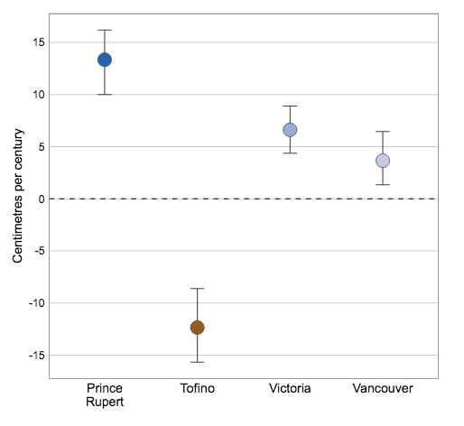
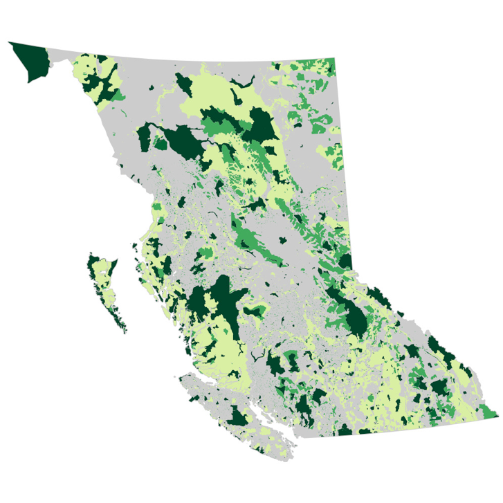
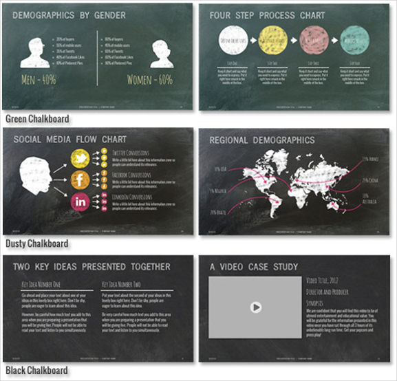
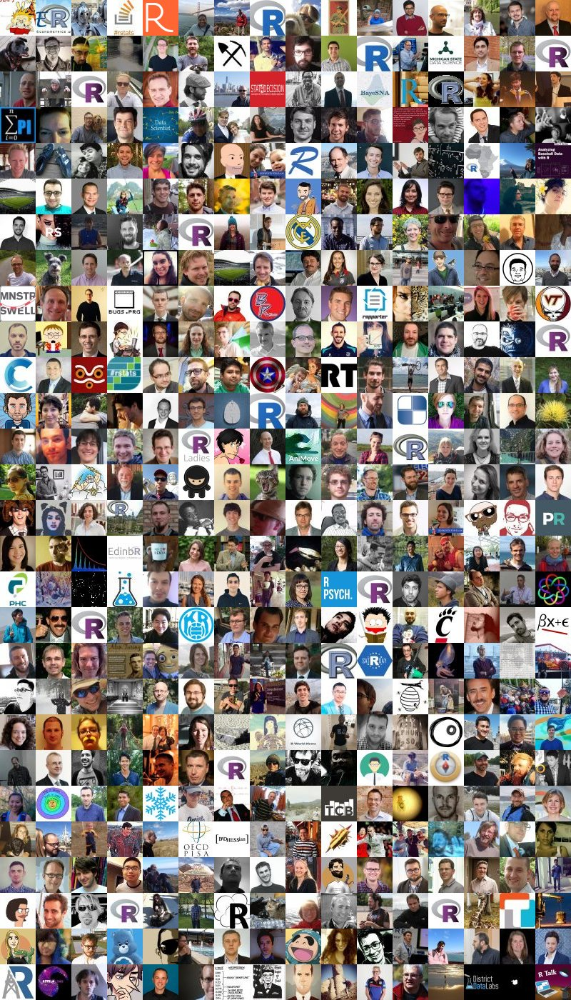
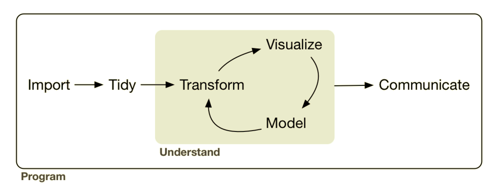

```{r setup, include=FALSE}
options(htmltools.dir.version = FALSE)
knitr::opts_chunk$set(warning = FALSE, 
                      message = FALSE, 
                      cache = TRUE, 
                      fig.align = 'center')
```

class: inverse

background-image: url(img/BC_ENV_V_RGB_rev.png)

???

- interrupt and ask questions and use the ethernet pad.

---

background-image: url(img/okr_montage.png)

???

- University of Calgary Zoology
- MSc Ecology - impact of roads and linear features on Ord's Kangaroo Rats in AB - finished 2006.
- Supervisor in Geography - landscape ecology focus - lots of spatial stuff, traditional statistics
- A bit of contract work locally in Alberta
- Job working with B.C. Ministry of Environment working on species at risk
- Then moved to State of Environment as Analyst - love data, opportunity to work with data from a huge breadth of environmental topics

---

class: inverse

background-image: url(img/bc_layers.gif)

???

- Overview of the state of geomatics and spatial stuff in B.C.
- BC is big, natural resource based economy.
- Making good decisions for land use requires lots of spatial data
and spatial analysis
- timber allocation, species at risk, cumulative effects, wildfire managemnt, etc

---

background-image: url(img/geographic_services.png)

https://www2.gov.bc.ca/gov/content/data/geographic-data-services

???

- Wide range of geographic services
- valuable services like B.C. geocoder
- some for quickly exploring data sets (B.C. maphub, iMap) (NOTE more info on next two slides)

---

background-image: url(img/maphub.png)

https://governmentofbc.maps.arcgis.com/home/index.html

---

background-image: url(img/iMap_2018.png)

---

background-image: url(img/bc_data_cat.png)

???

- DATA CATALOGUE
  - metadata, license, contact info
  - Interrogate your data!

---

background-image: url(img/ogl_bc.png)

???

- Intro to open data. What is open vs public?
- Pay attention to licensing

---

background-image: url(img/bcgov_github_home.png)

???

- What is GitHub?
- Open licensed code
- Government's official place to share code

---

background-image: url(img/envreportbc_homepage.png)

???

- We don't work in geomatics services
- Job is to report to the public on status and trends of various aspects of the environmnet
- Webpage, twitter account, github

---
class: centre, middle

.pull-left[

]
.pull-right[

]

???

- We use all kinds of data - and a lot of it is spatial - make a lot of maps
- talk less about what we make, and more about how we make it, and why.

- hope that by sharing the workflows and processes that we've learned and work well for us it will give you some useful food for thought as you develop your careers as geomatics professionals.

---

background-image: url(img/spreadsheet.png)

???

Instead of spending a lot of time convincing you of R's spatial powers (which are many), I'm going to try to convince why using a tool like R is a good idea for any sort of analytical work, including spatial, which by the way R is REALLY good for.

I'm going to start off by describing a pretty common scenario, and then talk about how using **R** can help:

- You're doing a big project for a client. You have a four or five spatial files and a few csvs or Excel sheets containing data related to the spatial layers. 
- First you do a bunch of data cleaning in the spreadsheets - fixing date formats, unit conversions, transformations, unify inconsistent variable names, etc.

---

background-image: url(img/arcmap.jpg)

???

- You import the layers into a GIS, do a bunch of spatial operations - intersects, unions, buffers, spatial joins, etc.
- You import the tabular data and join it to the appropriate layers, and do more work.

---

background-image: url(img/arcmap-layout.jpg)

???

- Spend some time creating really nice looking map for final report

---

background-image: url(img/graph.png)

???

- Export the tabular data out so you can summarize it and make some nice graphs in Excel

---

class: middle, center

.pull-left[]

???

- Combine the results in a word document, convert it to a pdf and give to your client.

--

# "Thank you for your hard work, this is exactly what we were looking for!"

???

They thank you for your great work

---
class: inverse

## "But, I think I gave you the wrong version of shapefile #2. Oh, and that Excel spreadsheet has been updated."

???

But say 'Oh, I think I gave you the wrong version of one of the spatial files, and that Excel spreadsheet has been updated.'

--

.center[]

---

background-image: url(img/full-cycle.png)

???

- Can you redo the analysis exactly the same way? How long will it take you?

---

background-image: url(img/Rlogo.png)

## Open source programming language
## Data analysis focus
## Cross-platform

???

# What is R?

- R is an open-source programming language for data analysis and visualization.
  - In many ways it is similar to other general purpose interpreted languages like Python, but unlike Python, R was originally created as a statistical programming language and so it is designed from the ground up around the manipulation, analysis, and visualization of data - it is now often considered the 'lingua franca' of data.
  - It also easy to make publication-quality graphics.
  - R is available for Windows, MacOS and most popular Linux distributions.
  - You can run it interactively by typing directly into the console, or from a sequence of commands written in text files, or "scripts". Scripts can be run against a dataset to produce a defined output, such as a chart or another dataset which contains the results of the analysis.


---

background-image: url(img/efficiency-car.jpg)

# Efficiency

???

So, what can **R** give you?

---

background-image: url(img/branch_tweet.png)

---

background-image: url(img/full-cycle.png)

???

The entire workflow can be done efficiently in **R**, including:

- reading in raw data from many different sources - spatial and non-spatial, 
- preparing the data for analysis, including easily integrating tabular and spatial data,
- performing spatial data manipulation and analysis,
- performing statistical analysis
- creating publication-quality graphs and figures.

---

background-image: url(img/R-flow.png)

???

The entire workflow can be done efficiently in **R**, including:

- reading in raw data from many different sources - spatial and non-spatial, 
- preparing the data for analysis, including easily integrating tabular and spatial data,
- performing spatial data manipulation and analysis,
- performing statistical analysis
- creating publication-quality graphs and figures.
- All your iteration happens in one place, and is recorded in scripts

---

background-image: url(img/photocopier.jpg)

# Reproducibility

???

Reproducibilty means:

- *You can easily recreate or update exactly what you did*: 
  - In the scenario I described, If you coded the entire above workflow in an R script, you can just change a few lines to change the input data and rerun the scripts.
- *You know what you did*: 
  - Doing your data preparation and analysis by coding it in **R** necessarily documents every step. The analysis and documentation are inextricably intertwined.
- *Others know what you did*: 
  - They can inspect and re-run your code to understand what you did, verify you've done it correctly, and build on your work.

---

background-image: url(img/k-car.jpg)

# Reliability

???

Using **R** can help you:

- *Minimize errors*: 
  - point and click and copy and paste operations are very error-prone, and it's hard to catch those errors
- And you can *find and correct errors* more easily: 
  - Changing a bit of code and re-running your script is much more efficient than doing it manually (without making another error).

---

background-image: url(img/swiss-army.jpg)

# Versatility

???

R has a huge array of add-on packages that extend the capabilities of R for performing diverse tasks, including:

- data manipulation, 
- data visualization, and
- almost every statistical method you can think of
- With a wide range of packages R also supports advanced geospatial statistics, modeling and visualization.
- Packages are generally published on CRAN - or the "Comprehensive R Archive Network", these packages are easily installable by a user from within R.

---

# Community

.img-right[]

.footnote[['Faces of R' by Maelle Salmon](http://www.masalmon.eu/2017/03/19/facesofr/)]

???

I think one of the best reasons to use **R** is the:

Fantastic online **R** Community

- **R** is hugely popular right now.
- If you have a question or are having a problem, 99% of the time you'll find that it has already been asked and answered online. And if it hasn't, people are almost always willing to help out.
- (rstats, community.rstudio.com, mailing lists, StackOverflow, RWeekly)

---

# Data Science
.center[]

.footnote[Wickham and Grolemund: [R for Data Science](http://r4ds.had.co.nz/)]

???

- hyped word, lots of definities out there
- To me - it's data analysis but inclusive of all steps of the data cycle, with a greater emphasis on programming.
- Spatial analysis can easily be fit into this framework, another side of the same coin.

---

# Geographical Data Science
.center[]

.footnote[Wickham and Grolemund: [R for Data Science](http://r4ds.had.co.nz/)]

???

- movement labelled Geographical Data Science (GDS). Combines ‘data science’ with GIS.
- focus on reproducibility and programming interface

---

### .center[Geographic Information Systems (GIS)</br>vs</br>Geographic Data Science (GDS)<sup>1</sup>]

.middle[
```{r echo=FALSE}
library(readr)
tbl_11.1 <- read_csv('Attribute,GIS,GDS
Home disciplines,Geography,"Geography, Computing, Statistics"
Software focus,Graphical User Interface,Code
Reproducibility,Minimal,Maximal')

knitr::kable(tbl_11.1, format = "html")
```
]

.footnote[
[1] Lovelace, Nowosad, and Muenchow: Geocomputation with R ([Table 1.1](https://geocompr.robinlovelace.net/intro.html#tab:gdsl))
]

???

Why R for spatial?

- Generally the same arguments as I made above for general data analysis.

- reading, writing and manipulating spatial data; making static and interactive maps; and spatial statistics and modelling

- Ability to seamlessly switch between spatial and non-spatial data processing, modeling and visualization tasks

---
background-image: url(img/vic-open-data.png)
---
background-image: url(img/dog.png)
---
```{r include=FALSE, eval=FALSE}
temp <- tempfile()
download.file("http://vicmap.victoria.ca/_GISData/DogsByNeighbourhoodSHP.zip", destfile = temp)
unzip(temp, exdir = "data/dogs")
```

```{r}
library(sf)
library(mapview)
dogs <- read_sf("data/dogs/DogsByNeighbourhood.shp")

mapview(dogs)
```

???

sf - new package that implements the simple features spec in R for representing spatial data
 - Binds to GDAL for reading and writing data, to GEOS for geometrical operations, and to Proj.4 for projection conversions and datum transformations
 - can read and write almost any format

---

```{r}
library(ggplot2)

ggplot() + 
  geom_sf(data = dogs, aes(fill = DogLicence)) + 
  scale_fill_viridis_c() + theme_minimal()
```

???

Plotting - built-in in sf, even better in ggplot2

---

background-image: url(img/hydrant.png)

---

```{r include=FALSE, eval=FALSE}
temp <- tempfile()
download.file("http://vicmap.victoria.ca/_GISData/HydrantsSHP.zip", destfile = temp)
unzip(temp, exdir = "data/hydrants")
```


```{r}
hydrants <- read_sf("data/hydrants/Hydrants.shp")

ggplot() + 
  geom_sf(data = hydrants) + 
  theme_minimal()
```

---

```{r}
hydrants <- st_intersection(hydrants, st_geometry(dogs))
ggplot() + 
  geom_sf(data = dogs, aes(fill = DogLicence)) + 
  geom_sf(data = hydrants, colour = "white") + 
  scale_fill_viridis_c() + theme_minimal()
```

???

### geometry generating logical operators

* `st_union`: union of several geometries
* `st_intersection`: intersection of pairs of geometries
* `st_difference`: difference between pairs of geometries
* `st_sym_difference`: symmetric difference (`xor`)

---

```{r eval=require(dplyr)}
dogs_and_hydrants <- st_join(dogs, hydrants) %>% 
  group_by(Neighbourh) %>% 
  summarize(licences = max(DogLicence), 
            n_hydrants = length(unique(ID)), 
            hydrants_per_dog = n_hydrants / licences)
```

```{r echo=FALSE}
knitr::kable(st_set_geometry(dogs_and_hydrants, NULL), format = "html")
```

???

### logical binary geometry predicates

* `st_intersects`: touch or overlap
* `st_disjoint`: !intersects
* `st_touches`: touch
* `st_crosses`: cross (don't touch)
* `st_within`: within
* `st_contains`: contains
* `st_overlaps`: overlaps
* `st_covers`: cover
* `st_covered_by`: covered by
* `st_equals`: equals
* `st_equals_exact`: equals, with some fuzz

### higher-level operations: summarise, interpolate, aggregate, st_join

* `aggregate` and `summarise` use `st_union` (by default) to group feature geometries
* `st_interpolate_aw`: area-weighted interpolation, uses `st_intersection` to interpolate or redistribute attribute values, based on area of overlap:
* `st_join` uses one of the logical binary geometry predicates (default: `st_intersects`) to join records in table pairs

### manipulating geometries

* `st_line_merge`: merges lines
* `st_segmentize`: adds points to straight lines
* `st_voronoi`: creates voronoi tesselation
* `st_centroid`: gives centroid of geometry
* `st_convex_hull`: creates convex hull of set of points
* `st_triangulate`: triangulates set of points (not constrained)
* `st_polygonize`: creates polygon from lines that form a closed ring
* `st_simplify`: simplifies lines by removing vertices
* `st_split`: split a polygon given line geometry
* `st_buffer`: compute a buffer around this geometry/each geometry
* `st_make_valid`: tries to make an invalid geometry valid (requires lwgeom)
* `st_boundary`: return the boundary of a geometry

---

```{r}
ggplot() + 
  geom_sf(data = dogs_and_hydrants, aes(fill = hydrants_per_dog)) + 
  scale_fill_viridis_c() + theme_minimal()
```

---

```{r fig.width=8}
ggplot(dogs_and_hydrants, aes(x = Neighbourh, y = hydrants_per_dog)) + 
  geom_col(aes(fill = licences)) + scale_fill_viridis_c() + 
  coord_flip() + theme_minimal()
```

???

- simple example but demo of reproducibile and rerunnable with new data

---


.pull-left[

]
.pull-right[

]

---

```{r eval=require(leaflet)}
leaflet() %>%
  addProviderTiles("Stamen.TonerLite") %>% 
  addAwesomeMarkers(lng = -123.2499699, lat = 49.260633, 
                    label = paste0("<h3>", emo::ji("evergreen_tree"), "</h3>"), 
                    labelOptions = labelOptions(noHide = TRUE))
```

???

- ends the meaty content of our talk, now a bit more context and starting off points to explore opportunites in the public service...

---

background-image: url(img/bcgov_jobs.png)

---

background-image: url(img/MyHR_search.png)

---

background-image: url(img/bcgov_dir_example.png)

---

background-image: url(img/github_jwyx.png)

---

## Us:

Twitter: @EnvReportBC, @andyteucher, @stephhazlitt

GitHub: bcgov; @ateucher, @stephhazlitt


.footnote[Slides made with R and the [xaringan](https://slides.yihui.name/xaringan/) package.]
