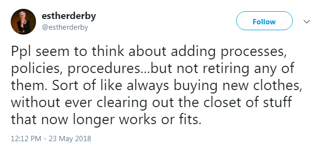

# Overcoming gravity & achieving escape velocity


author: Martin Monkman
date of most recent revision: 2018-11-13

**EARL, Seattle 2018-11-07**

https://earlconf.com/2018/seattle/

https://earlconf.com/2018/seattle/#martin-monkman


## Abstract

Talk theme:

* Corporate R use cases

* Challenges of using R in the commercial world

Category: Challenges

It is a truth universally acknowledged that large organizations (public and private sector) develop policies, procedures, and cultures that standardize and streamline business processes, with the aim of making the organization more cost-efficient and to minimize risk.

But these corporate policies can inhibit innovations. Gordon Macdonald has dubbed these policies, procedures, and cultures The Giant Hairball. And the gravity of the Hairball "exercises an inexorable pull into mediocrity". 

The Province of British Columbia has created a space that allows for the experimental use of open source tools (including R), open development, and open data. This operating environment has allowed BC Stats and other data analysis shops within the B.C. Public Service to go into orbit around the Hairball, including the adoption of R and the implementation of the robust data science workflow that R facilitates.

I will present about the

* motivations behind the establishment of the operating environment

* the specific systems that enable us to adopt R and the related innovations

* why BC Stats has started working in that space

* how BC Stats and other data analysis functions in the B.C. Public Service has used the environment, and where we see moving forward


***

## BC Stats: a bit of context

BC Stats, the provincial statistics agency in British Columbia, got its start in 1894 with the passing of the _Legislative Library and Statistics Bureau Act_. 


That legislation has been updated, and we now operate under the authority of the [Statistics Act](http://www.bclaws.ca/civix/document/id/complete/statreg/96439_01). This act provides protection to personal and business information that we collect, and spells out the mandate of the branch:

> …collect, compile, compare, analyze, abstract, project and distribute statistical information respecting the commercial, industrial, financial, social, economic and general activities and conditions of British Columbia and persons in British Columbia or doing business in British Columbia

In practical terms, we operate as an internal consultancy, providing statistical evidence to policy makers across the government, the broader public sector (such as health administrators and school boards), businesses, and the public. We do this through analysis of existing Statistics Canada data (including the Census of Canada), administrative data collected by B.C. government ministries and agencies, and surveys that we carry out.

Our workflow looks like the model of data science in Grolemund & Wickham's [_R for Data Science_](https://r4ds.had.co.nz/index.html) (although we are also directly involved in the collection of the data, in advance of the "import" step):


### The road to R

The tools we have been using in our data science workflow has been a mix of proprietary programs, from the ubiquitous Microsoft Excel and Access, to specialized tools like SPSS and STATA, and on to the arcane [APL](https://en.wikipedia.org/wiki/APL_(programming_language)).


But none of these tools hit all the marks for open, reproducible research. Some store the data in proprietary formats, making it difficult to move data between tools without significant manual intervention. Some are GUIs, and we know [you can't do data science in a GUI](https://speakerdeck.com/hadley/you-cant-do-data-science-in-a-gui). This also means there's no code sharing, so collaboration is impeded (if not impossible). And some come with costly license fees.

But then in approximately 2008 or '09 I started to hear about these open source tools that are revolutionizing statistical analysis and this new-fangled “data science” thing, 

So I was curious if R would be something useful for us in our work. 

In 2012 I set out to learn more, first by downloading and installing R on my work computer. But when I attempted to install R onto my work computer about five years ago, I got this sort of message:


I then discovered that getting R installed meant requesting that someone from our IT department request a 30 minute window of admin priviledge on my machine, then when that was granted, they were able to install the software and any packages I'd specified. The whole process took approximately two weeks.

But being new to R, I was naive as to which packages I would need to install for some core functionality, how frequently they would need to be updated, and how confronting a new data science problem would lead me to a solution that required packages I didn't yet have. So I quickly got frustrated by my inability use my work computer to do what I wanted in R. 

So I went home and installed R on my personal computer. This allowed me to learn R, a process I have sporadically documented on my blog bayesball.blogspot.com (also part of the R-Bloggers). This also led me to become a contributor to the [Lahman package](https://cran.r-project.org/web/packages/Lahman/index.html), a collection of baseball data.


***
## The Hairball

It is a truth universally acknowledged that large organizations (public and private sector) develop policies, procedures, and cultures that standardize and streamline business processes, with the aim of making the organization more cost-efficient and to minimize risk.

It's worth remembering that the policies and procedures that cause this grief are, almost invariably, created with the aim of achieving a valid goal. 

One example: research ethics. I don't think that anyone would argue that ethical research is a bad idea; the protocols and evaluation processes prior to launching research on human subjects are intended to minimize the harm those individuals are subject to. But there's a substantial literature on how the process of implementing research ethics gets in the way of the outcome of research; a recent paper asks the question "Are we minimizing harm or maximizing bureacracy?"[^5]

But these policies and procedures accumulate, sometimes conflicting with one another.




These corporate policies--while originally well-intentioned--can inhibit innovations. Gordon Macdonald has dubbed these policies, procedures, and cultures The Giant Hairball[^1]. 


And the Hairball is a recurring theme in popular culture. One example is the character of Mordac the Preventer of IT in the _Dilbert_ comic strip. 

```{r, echo=FALSE, fig.align='left'}

knitr::include_graphics("images/informationprevention.gif") 

```


And it's often those who want to jump on the "innovation" train who are the most constrained:


```{r, echo=FALSE, out.height= "400x", fig.align='left'}

knitr::include_graphics("images/digital_transformation.JPG") 

```


https://www.instagram.com/p/BpYiky-BISZ/?utm_source=ig_web_button_share_sheet


Science fiction--particularly the dystopian variety--, from _Brazil_ and _Star Trek: Deep Space Nine_ to _Futurama_, is full of Hairballs. And many of those Hairballs are associated with government organizations.[^1] One of my favourites (?) are the Vogons in _The Hitchhiker's Guide to the Galaxy_, described as "Not actually evil, but bad-tempered, bureaucratic, officious and callous."


```{r, echo=FALSE, out.height= "400x", fig.align='left'}

knitr::include_graphics("images/vogons_resubmit.jpg") 

```


As they say, it's funny because it's true. 

And the Hairball makes our lives challenging. 

There are numerous real-life examples; twitter is full of people expressing frustration with the Hairball. Here's one from the academy, articulating one manner students across the planet encounter the Hairball:

<blockquote class="twitter-tweet" data-lang="en"><p lang="en" dir="ltr">The hardest part of grad school is making sure you meet all the arbitrary style guidelines set forth by all the &quot;important&quot; people in the grad school office. <a href="https://t.co/rxD1o3DHuW">https://t.co/rxD1o3DHuW</a></p>&mdash; DOCTOR Greg (@StatsInTheWild) <a href="https://twitter.com/StatsInTheWild/status/1023396704505286657?ref_src=twsrc%5Etfw">July 29, 2018</a></blockquote>
<script async src="https://platform.twitter.com/widgets.js" charset="utf-8"></script>
[^4]


So the policies of the Hairball usually come from a place of reasonable intentions, but often lead to unintended consequences.


### What it does


### and how it impacts our work

And the gravity of the Hairball "exercises an inexorable pull into mediocrity"[^2]. Because it can be exhausting to deal with the Hairball (whether that's working with it, around it, or against it), the very presence of the Hairball can act as an inhibitor. As Mackenzie says, it has an impact on how people approach their work.

https://twitter.com/NormaPadron_/status/1002308667499261958

<blockquote class="twitter-tweet" data-lang="en"><p lang="en" dir="ltr">This is true across all types of orgs— I fundamentally believe that good deal of what’s attributed to bad culture/lack of engagement is  due to not providing the right tools and data to enable folks to work at their best<br><br>Innovation can’t be forced but environment can be changed <a href="https://t.co/RXlqtPhI11">https://t.co/RXlqtPhI11</a></p>&mdash; Norma A. Padrón (@NormaPadron_) <a href="https://twitter.com/NormaPadron_/status/1002308667499261958?ref_src=twsrc%5Etfw">May 31, 2018</a></blockquote>
<script async src="https://platform.twitter.com/widgets.js" charset="utf-8"></script>


And I know that I'm not alone in encountering the hairball when implementing R in our workflow:

https://twitter.com/AdamGruer/status/1013538660132589568

<blockquote class="twitter-tweet" data-lang="en"><p lang="en" dir="ltr">Can anybody point me to some good resources for starting a conversation with the IT department about making  <a href="https://twitter.com/hashtag/rstats?src=hash&amp;ref_src=twsrc%5Etfw">#rstats</a> , <a href="https://twitter.com/hashtag/rstudio?src=hash&amp;ref_src=twsrc%5Etfw">#rstudio</a> , shiny etc an accepted part of software kit? As far as I know most of our servers are windows OS %&gt;%</p>&mdash; Adam Gruer (@AdamGruer) <a href="https://twitter.com/AdamGruer/status/1013538660132589568?ref_src=twsrc%5Etfw">July 1, 2018</a></blockquote>
<script async src="https://platform.twitter.com/widgets.js" charset="utf-8"></script>


Sean Boots, ["Use the tools that you need to do good work"](https://digital.canada.ca/2018/06/27/tools-to-do-good-work/) (2018-06-27)

https://twitter.com/sboots/status/1014145932018049024

In response to Boots' tweet:

https://twitter.com/don_cooper/status/1014170397732790272

<blockquote class="twitter-tweet" data-lang="en"><p lang="en" dir="ltr">Reminds me of the days when Finance ran IT...a request for Internet access was met with “you don’t need access to the Internet...that will cost $50/seat”.    See the theme?  IT wants to control IT.  Finance wants to control $.  Both r service providers who don’t provide service</p>&mdash; Don Cooper (@don_cooper) <a href="https://twitter.com/don_cooper/status/1014170397732790272?ref_src=twsrc%5Etfw">July 3, 2018</a></blockquote>
<script async src="https://platform.twitter.com/widgets.js" charset="utf-8"></script>


And Mackenzie notes that the hairball keeps getting bigger as an organization grows, and as time passes.


https://twitter.com/estherderby/status/999367593625612293

<blockquote class="twitter-tweet" data-lang="en"><p lang="en" dir="ltr">Ppl seem to think about adding processes, policies, procedures...but not retiring any of them. Sort of like always buying new clothes, without ever clearing out the closet of stuff that now longer works or fits.</p>&mdash; estherderby (@estherderby) <a href="https://twitter.com/estherderby/status/999367593625612293?ref_src=twsrc%5Etfw">May 23, 2018</a></blockquote>
<script async src="https://platform.twitter.com/widgets.js" charset="utf-8"></script>


***

## In Orbit
### or, the view from here


```{r, echo=FALSE, out.width= "400x", fig.align='left'}

knitr::include_graphics("images/nasa_astronaut_canadarm.jpg") 

```


The Province of British Columbia--and here I'm speaking of the public service narrowly defined, a group of roughly 25,000 civil servants organized (currently) into 21 ministries and public agencies (or departments)--has, like other organizations, created its own hairball. 

And BC Stats has had nearly a century and a quarter to develop our own little hairball within the bigger one.

But in spite of that, we are getting some recognition in the R community:

* Hadley Wickham is citing the work of my colleagues in the Ministry of Environment in his talks:


* Jenny Bryan tweeting the fact that B.C. Government's github site has over 200 repositories.

* useR! 2018's justifiably famous hex map of Australia featured two packages that BC Government staff have submitted to CRAN


Some examples of how BC Stats has been using R:

* WES automation

* bookdown

* Shiny

* cansim 


***

## The Launch Pad
### or, things that enabled getting into orbit


```{r, echo=FALSE, out.height= "400x", fig.align='left'}

knitr::include_graphics("images/Estes_launchpad_01.jpg") 

```


> "Escape velocity is the speed needed to break free from the gravitational attraction of a massive body without further propulsion. Achieving it takes lots of energy, especially if the gravitational pull is strong."


So I sought out information about the Administrative Privilege Policy for our ministry, thinking that there might be a way to make a request to have it granted. I found this rather lengthy policy document:

```{r, echo=FALSE, out.width= "400x", fig.align='left'}

knitr::include_graphics("images/admin_privilege_policy.PNG") 

```

You may note that in the first paragraph the reader is referred to a second policy document, the BC Government's Information Security Policy. The Hairball!


### Skunk works

The Province of British Columbia has created a space that allows for the experimental use of open source tools (including R), open development, and open data. This operating environment has allowed BC Stats and other data analysis shops within the B.C. Public Service to go into orbit around the Hairball, including the adoption of R and the implementation of the robust data science workflow that R facilitates.


- admin exemption

- open data [(DataBC)](https://data.gov.bc.ca/)

- [github.com/bcgov](https://github.com/bcgov)
 
  - open data platform requires open development (posting of code)

- BC DevEx ([bcdevexchange.org](https://bcdevexchange.org/))


### The Team

- "Coalition of the Willing"

- _Good to Great_ 

  - get the right people on the bus, and then find the right seat for them
  
  - _Design Thinking_ reference to right people


***


## Staying in Orbit
### or, things we're doing to make sure we don't crash back into the hairball


```{r, echo=FALSE, out.width="400x", fig.align='left'}

knitr::include_graphics("images/800px-Skylab.jpg") 

```


Skylab[^6]: the NASA space station launched in 1973 (following the end of the Apollo moon landings), in 1979 it fell out of orbit and landed in Western Australia. 

We are mindful of the fact that getting into orbit is one thing--staying there is quite another. So we continue to push in a variety of directions to ensure that we have the momentum to stay in orbit and not get pulled back into The Hairball.


#### technology / solutions

- shinyapps.io

- RStudio Connect


#### collaborative efforts

- packages (Stephanie Kirmer's talk!)

- 


#### professional development

- online training

- Dr. Charlotte Wickman


#### team 

Angela Bassa's recent HBR article[^7]

- value diversity of "academic discipline and professional experience but also of lived experience and perspective"


#### community 

- bcgov useR day

  - help-a-thon

- Victoria & Vancouver RLadies

- academic connections

  - UBC Master of Data Science

- social media: yammer, slack

- proposal for Vancouver to host useR! 2020


#### Guidelines, not rules

- Hilary Parker "Opininated Analysis Development"
 
- Gabe Becker: EARL 2017 talk

Important ideas but it's a balance--we don't want to create our very own R-centric hairballs that disempower and constrain the data scientists


***

## Conclusion

Policies and procedures are a fact of life in any organization. The book by Gordon Mackenzie gives us a useful metaphor--The Giant Hairball--to understand them, and the further metaphor that it's possible to go into orbit around them.

BC Stats, in our adoption and implementation of R, has gone into orbit. And we intend on staying there.

But it's not just branches of the larger organization--like BC Stats is part of the British Columbia government--that have to deal with The Hairball. Individuals confront it too, and it can be frustrating. Here's professor who has identified that his personal style is at odds with The Hairball:

https://twitter.com/jtleek/status/987043234168934404

<blockquote class="twitter-tweet" data-lang="en"><p lang="en" dir="ltr">Anyone else have the problem of being an outcome productivity person in a process productivity place? <a href="https://t.co/PzudFdP3EC">https://t.co/PzudFdP3EC</a></p>&mdash; Jeff Leek (@jtleek) <a href="https://twitter.com/jtleek/status/987043234168934404?ref_src=twsrc%5Etfw">April 19, 2018</a></blockquote>
<script async src="https://platform.twitter.com/widgets.js" charset="utf-8"></script>


Gordon Mackenzie gives us a tool as individuals, which will help us better cope when we encounter The Hairball in our day-to-day lives. The sub-title of the book is "A Corporate Fool's Guide to Surviving with Grace".

If we recognize that The Hairball exists, it can become easier--more tolerable--for us to deal with "process productivity". As Mackenzie puts it, we need to "find the goals of the organization that touch your heart and release your passion to follow those goals." [^8]

> It is a delicate balance, resisting the hypnotic spell of an organization's culture and, at the same time, remaining committed from the heart to the personally relevant goals of the organization. But if you can achieve that balance and maintain it, you will be out of the Hairball and into Orbit, the only place where you can tap your one-of-a-kind magic, your genius, your limitless creativity.


***

### Footnotes

[^1] Rob Thomas, ["From the Vogons to Bob - Public Servants in Space"](https://innovation.govspace.gov.au/vogons-bob-public-servants-space), 2016-01-15

[^1]: Gordon Mackenzie, _Orbiting the Giant Hairball: A Corporate Fool's Guide to Surviving With Grace_, Penguin Random House, 1998.

[^2]: [_Orbiting the Giant Hairball_ product page](https://www.penguinrandomhouse.com/books/330616/orbiting-the-giant-hairball-by-gordon-mackenzie/9780670879830/)

[^3]: Douglas Adams, _Hitchhiker's Guide to the Galaxy_

[^4]: [@StatsInTheWild tweet](https://twitter.com/StatsInTheWild/status/1023396704505286657)

[^5]: Karen Robson & Reana Maier, ["Research ethics: are we minimizing harm or maximizing bureaucracy?"](https://www.universityaffairs.ca/opinion/in-my-opinion/research-ethics-are-we-minimizing-harm-or-maximizing-bureaucracy/), _Universtiy Affairs_, 2018-10-08

[^6]: [Skylab Wikipedia entry](https://en.wikipedia.org/wiki/Skylab)

[^7]: Angela Bassa, ["Managing a Data Science Team"](https://hbr.org/2018/10/managing-a-data-science-team), Harvard Business Review, 2018-10-24

[^8]: Mackenzie, p53.
