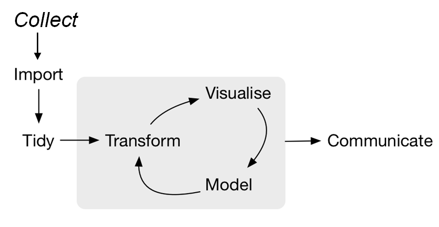
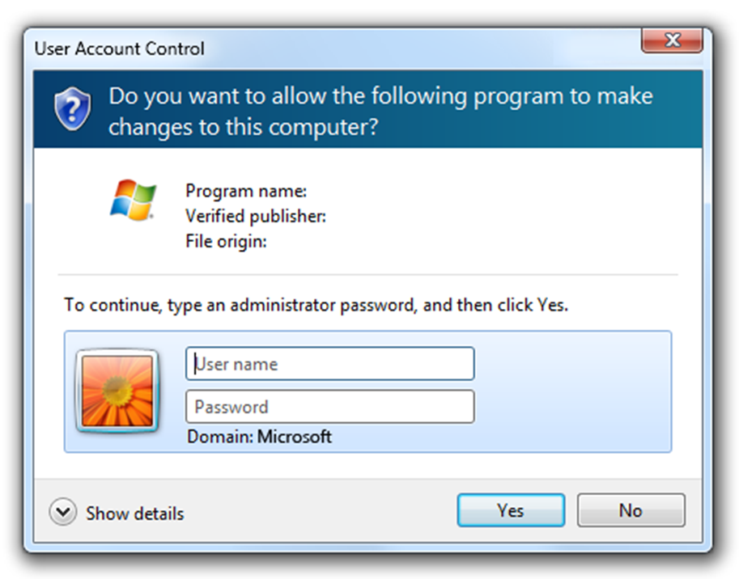
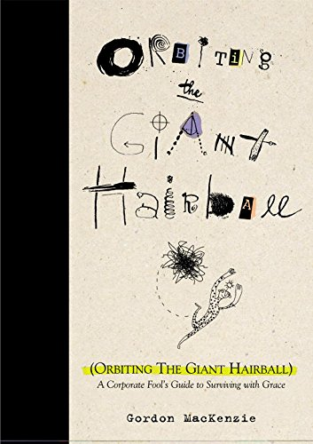
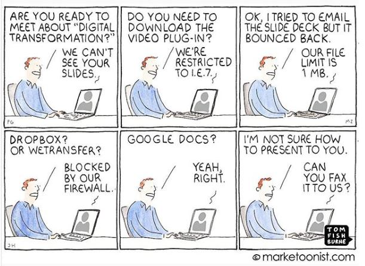
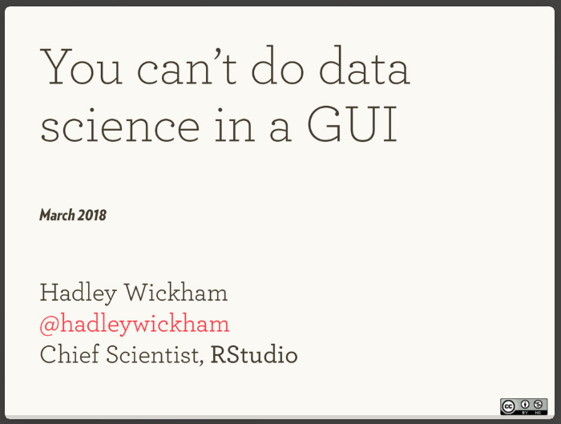
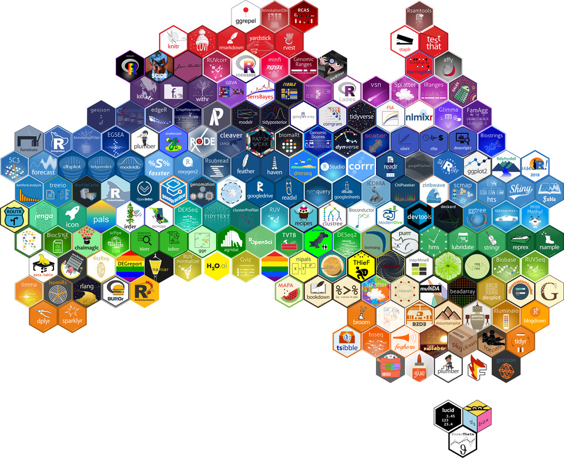
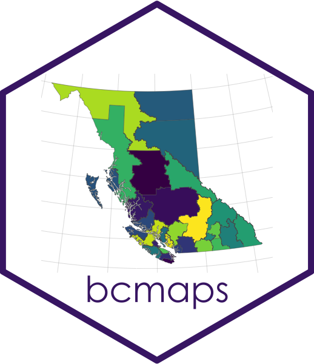
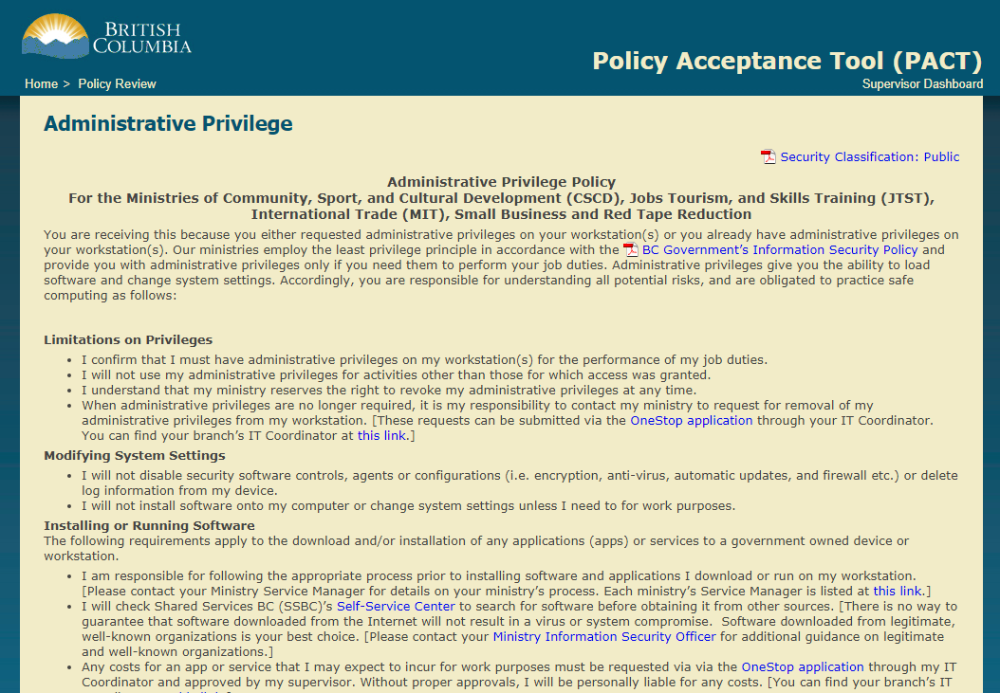
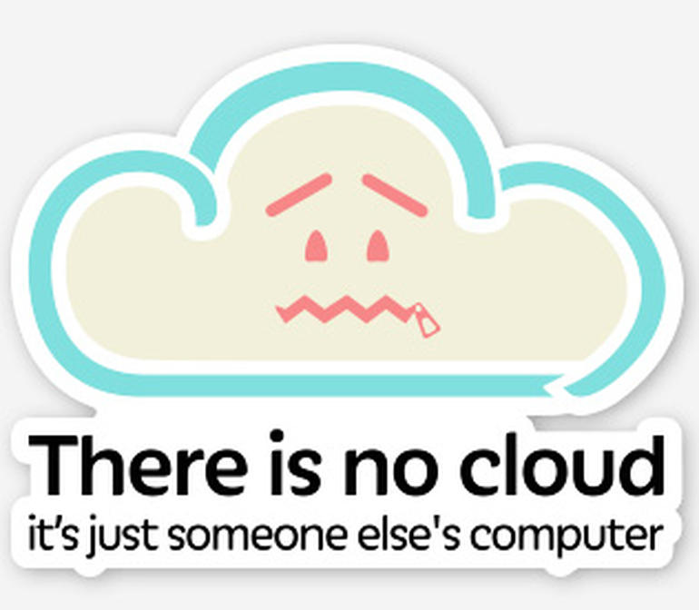

<!--
Copyright 2018 Province of British Columbia

This work is licensed under the Creative Commons Attribution 4.0 International License.
To view a copy of this license, visit http://creativecommons.org/licenses/by/4.0/.
-->

# Overcoming gravity & achieving escape velocity

author: Martin Monkman

date of most recent revision: 2019-01-17

**EARL, Seattle 2018-11-07**

https://earlconf.com/2018/seattle/

https://earlconf.com/2018/seattle/#martin-monkman

## Abstract

Talk theme:

* Corporate R use cases

* Challenges of using R in the commercial world

Category: Challenges

It is a truth universally acknowledged that large organizations (public and private sector) develop policies, procedures, and cultures that standardize and streamline business processes, with the aim of making the organization more cost-efficient and to minimize risk.

But these corporate policies can inhibit innovations. Gordon Macdonald has dubbed these policies, procedures, and cultures The Giant Hairball. And the gravity of the Hairball "exercises an inexorable pull into mediocrity". 

The Province of British Columbia has created a space that allows for the experimental use of open source tools (including R), open development, and open data. This operating environment has allowed BC Stats and other data analysis shops within the B.C. Public Service to go into orbit around the Hairball, including the adoption of R and the implementation of the robust data science workflow that R facilitates.

I will present about the

* motivations behind the establishment of the operating environment

* the specific systems that enable us to adopt R and the related innovations

* why BC Stats has started working in that space

* how BC Stats and other data analysis functions in the B.C. Public Service has used the environment, and where we see moving forward

***

## BC Stats: a bit of context

BC Stats, the provincial statistics agency in British Columbia, got its start in 1894 with the passing of the _Legislative Library and Statistics Bureau Act_. 

That legislation has been updated, and we now operate under the authority of the [Statistics Act](http://www.bclaws.ca/civix/document/id/complete/statreg/96439_01). This act provides protection to personal and business information that we collect, and spells out the mandate of the branch:

> …collect, compile, compare, analyze, abstract, project and distribute statistical information respecting the commercial, industrial, financial, social, economic and general activities and conditions of British Columbia and persons in British Columbia or doing business in British Columbia

In practical terms, we operate as an internal consultancy, providing statistical evidence to policy makers across the government, the broader public sector (such as health administrators and school boards), businesses, and the public. We do this through analysis of existing Statistics Canada data (including the Census of Canada), administrative data collected by B.C. government ministries and agencies, and surveys that we carry out.

Our workflow looks like the model of data science in Grolemund & Wickham's [_R for Data Science_](https://r4ds.had.co.nz/index.html) (although we are also directly involved in the collection of the data, in advance of the "import" step):

### The road to R

The tools we have been using in our data science workflow has been a mix of proprietary programs, from the ubiquitous Microsoft Excel and Access, to specialized tools like SPSS and STATA, and on to the arcane [APL](https://en.wikipedia.org/wiki/APL_(programming_language)).

But none of these tools hit all the marks for open, reproducible research. Some store the data in proprietary formats, making it difficult to move data between tools without significant manual intervention. Some are GUIs, and we know [you can't do data science in a GUI](https://speakerdeck.com/hadley/you-cant-do-data-science-in-a-gui) (See also [^1]). This also means there's no code sharing, so collaboration is impeded (if not impossible). And some come with costly license fees.

But then in approximately 2008 or '09 I started to hear about these open source tools that are revolutionizing statistical analysis and this new-fangled “data science” thing, 

So I was curious if R would be something useful for us in our work. 

In 2012 I set out to learn more, first by downloading and installing R on my work computer. But when I attempted to install R onto my work computer about five years ago, I got this sort of message:

I then discovered that getting R installed meant requesting that someone from our IT department request a 30 minute window of admin priviledge on my machine, then when that was granted, they were able to install the software and any packages I'd specified. The whole process took approximately two weeks.

But being new to R and the open source/multi-package model, I was naive about as to which packages I would need to install for some core functionality, how frequently they would need to be updated, and how confronting a new data science problem would lead me to a solution that required packages I didn't yet have. The installation of those packages, of course, required admin priviledge I didn't have, so I had to go through the whole request process again. And again. 

So I quickly got frustrated by my inability use my work computer to do what I wanted in R. 

So I went home and installed R on my personal computer. This allowed me to learn R, a process I have sporadically documented on my blog [bayesball.blogspot.com](http://bayesball.blogspot.com/) (also part of the [R-Bloggers](https://www.r-bloggers.com/)). This also led me to become a contributor to the [Lahman package](https://cran.r-project.org/web/packages/Lahman/index.html), a collection of baseball data.

***
## The Hairball

It is a truth universally acknowledged that large organizations (public and private sector) develop policies, procedures, and cultures that standardize and streamline business processes, with the aim of making the organization more cost-efficient and to minimize risk.

It's worth remembering that the policies and procedures that cause this grief are, almost invariably, created with the aim of achieving a valid goal. 

One example: research ethics. I don't think that anyone would argue that ethical research is a bad idea; the protocols and evaluation processes prior to launching research on human subjects are intended to minimize the harm those individuals are subject to. But there's a substantial literature on how the process of implementing research ethics gets in the way of the outcome of research; a recent paper asks the question "Are we minimizing harm or maximizing bureacracy?"[^2]

But these policies and procedures accumulate, sometimes conflicting with one another.

<blockquote class="twitter-tweet" data-lang="en">
Ppl seem to think about adding processes, policies, procedures...but not retiring any of them. Sort of like always buying new clothes, without ever clearing out the closet of stuff that now longer works or fits.
&mdash; estherderby (@estherderby) <a href="https://twitter.com/estherderby/status/999367593625612293?ref_src=twsrc%5Etfw">May 23, 2018</a>
</blockquote>

These corporate policies--while originally well-intentioned--can inhibit innovations. Gordon Macdonald has dubbed these policies, procedures, and cultures The Giant Hairball [^3]. 

And the Hairball is a recurring theme in popular culture. One example is the character of [Mordac the Preventer of IT](http://dilbert.com/search_results?terms=Mordac) in the _Dilbert_ comic strip. 

Science fiction--particularly the dystopian variety--, from _Brazil_ and _Star Trek: Deep Space Nine_ to _Futurama_, is full of Hairballs. And many of those Hairballs are associated with government organizations. [^4] One of my favourites are the Vogons in _The Hitchhiker's Guide to the Galaxy_, described as "Not actually evil, but bad-tempered, bureaucratic, officious and callous."

As they say, it's funny because it's true. 

And although the Hairball makes our lives challenging, it's often those who want to jump on the "innovation" train who are the most constrained by the Hairball:

Source: https://www.instagram.com/p/BpYiky-BISZ/

There are numerous real-life examples; twitter is full of people expressing frustration with the Hairball. 

Here's one from the academy, articulating one manner students across the planet encounter the Hairball:

<blockquote class="twitter-tweet" data-lang="en">
The hardest part of grad school is making sure you meet all the arbitrary style guidelines set forth by all the &quot;important&quot; people in the grad school office. <a href="https://t.co/rxD1o3DHuW">https://t.co/rxD1o3DHuW</a>
&mdash; DOCTOR Greg (@StatsInTheWild) <a href="https://twitter.com/StatsInTheWild/status/1023396704505286657?ref_src=twsrc%5Etfw">July 29, 2018</a></blockquote>

In short, the policies of the Hairball usually come from a place of reasonable intentions, but often lead to unintended consequences.

***

### What it does

### and how it impacts our work

And the gravity of the Hairball "exercises an inexorable pull into mediocrity" [^5]. Because it can be exhausting to deal with the Hairball (whether that's working with it, around it, or against it), the very presence of the Hairball can act as an inhibitor. As Mackenzie says, it has an impact on how people approach their work.

An example from twitter:

<blockquote class="twitter-tweet" data-lang="en">
This is true across all types of orgs— I fundamentally believe that good deal of what’s attributed to bad culture/lack of engagement is  due to not providing the right tools and data to enable folks to work at their best  Innovation can’t be forced but environment can be changed <a href="https://t.co/RXlqtPhI11">https://t.co/RXlqtPhI11</a>
&mdash; Norma A. Padrón (@NormaPadron_) <a href="https://twitter.com/NormaPadron_/status/1002308667499261958?ref_src=twsrc%5Etfw">May 31, 2018</a></blockquote>

And I know that I'm not alone in encountering the hairball when implementing R in our workflow:

<blockquote class="twitter-tweet" data-lang="en">
Can anybody point me to some good resources for starting a conversation with the IT department about making  <a href="https://twitter.com/hashtag/rstats?src=hash&amp;ref_src=twsrc%5Etfw">#rstats</a> , <a href="https://twitter.com/hashtag/rstudio?src=hash&amp;ref_src=twsrc%5Etfw">#rstudio</a> , shiny etc an accepted part of software kit? As far as I know most of our servers are windows OS %&gt;%
&mdash; Adam Gruer (@AdamGruer) <a href="https://twitter.com/AdamGruer/status/1013538660132589568?ref_src=twsrc%5Etfw">July 1, 2018</a></blockquote>

As Sean Boots has noted, the hairball limits access to hardware as well as software:

<blockquote class="twitter-tweet" data-lang="en">
New blog post from me! 👋 On why your department’s standard computers probably won’t cut it for modern digital work: <a href="https://t.co/asS5odSLXq">https://t.co/asS5odSLXq</a> <a href="https://twitter.com/hashtag/GCdigital?src=hash&amp;ref_src=twsrc%5Etfw">#GCdigital</a> <a href="https://t.co/e9gmrvx6qx">pic.twitter.com/e9gmrvx6qx</a>
&mdash; Sean Boots (@sboots) <a href="https://twitter.com/sboots/status/1014145932018049024?ref_src=twsrc%5Etfw">July 3, 2018</a></blockquote>

(Full article: Sean Boots, ["Use the tools that you need to do good work"](https://digital.canada.ca/2018/06/27/tools-to-do-good-work/) (2018-06-27))

There were many great responses to Boots' tweet, including this one:

<blockquote class="twitter-tweet" data-lang="en">
Reminds me of the days when Finance ran IT...a request for Internet access was met with “you don’t need access to the Internet...that will cost $50/seat”.    See the theme?  IT wants to control IT.  Finance wants to control $.  Both r service providers who don’t provide service
&mdash; Don Cooper (@don_cooper) <a href="https://twitter.com/don_cooper/status/1014170397732790272?ref_src=twsrc%5Etfw">July 3, 2018</a></blockquote>

***

## In Orbit
### or, the view from here

The Province of British Columbia--and here I'm speaking of the public service narrowly defined, a group of roughly 25,000 civil servants organized (currently) into 21 ministries and public agencies (or departments)--has, like other organizations, created its own hairball. And BC Stats has had nearly a century and a quarter to develop our own little hairball within the bigger one.

But in spite of the challenges I mentioned previously, in recent months R users in the B.C. public service are getting some significant recognition in the R community.

In January 2018, my colleagues in the State of Environment Reporting team published the package `bcmaps` to CRAN, and Jenny Bryan tweeted:

<blockquote class="twitter-tweet" data-lang="en">
I still can’t get over the fact that my province publishes <a href="https://twitter.com/hashtag/rstats?src=hash&amp;ref_src=twsrc%5Etfw">#rstats</a> packages  on CRAN and has 243 <a href="https://twitter.com/github?ref_src=twsrc%5Etfw">@github</a> repos. <a href="https://t.co/DjU066CuSf">https://t.co/DjU066CuSf</a>
&mdash; Jenny Bryan (@JennyBryan) <a href="https://twitter.com/JennyBryan/status/954251663086256128?ref_src=twsrc%5Etfw">January 19, 2018</a></blockquote>

Then, about six weeks later Hadley Wickham initiated this exchange with Stephanie Hazlitt, the head of the State of Environment Reporting team:

<blockquote class="twitter-tweet" data-lang="en">
I&#39;m looking for a data analysis .R/.Rmd on GitHub with data understandable by a lay audience, that shows analysis changes over time. Any ideas?
&mdash; Hadley Wickham (@hadleywickham) <a href="https://twitter.com/hadleywickham/status/971452620983427073?ref_src=twsrc%5Etfw">March 7, 2018</a></blockquote>

<blockquote class="twitter-tweet" data-lang="en">
If you mean analysis code changes, we updated this population data analysis code shifting to tidyverse 📦 &amp; style -&gt; master vs 2018-update branches  <a href="https://t.co/9yt5zd1Xpp">https://t.co/9yt5zd1Xpp</a>
&mdash; Stephanie Hazlitt (@stephhazlitt) <a href="https://twitter.com/stephhazlitt/status/971460589846331392?ref_src=twsrc%5Etfw">March 7, 2018</a></blockquote>

<blockquote class="twitter-tweet" data-lang="en">
Exactly what I’m looking for - thanks!
&mdash; Hadley Wickham (@hadleywickham) <a href="https://twitter.com/hadleywickham/status/971461971852787712?ref_src=twsrc%5Etfw">March 7, 2018</a></blockquote>

That example then made its way into the presentation ["You Can't Do Data Science in a GUI"](https://speakerdeck.com/hadley/you-cant-do-data-science-in-a-gui)

And then in the summer, my favourite. The useR! 2018 conference was held in Brisbane, and [the organizers had the brilliant idea of making a hex map of Australia, using R package hex stickers](https://blog.mitchelloharawild.com/blog/user-2018-feature-wall/). 

We were excited when we saw that it featured not one but two of the packages that B.C. Government staff have submitted to CRAN, [`tidyhydat`](https://github.com/ropensci/tidyhydat) (between `ggplot2` and the conference sticker, which is at Brisbane on the east coast) and [`bcmaps`](https://github.com/bcgov/bcmaps) (at [Surveyor Generals Corner](https://en.wikipedia.org/wiki/Surveyor_Generals_Corner)).

### Three examples of how BC Stats has been using R

#### 1. Voter List Quality: estimation and report preparation

After each general election in British Columbia since 2005, BC Stats has worked with the province's independent electoral agency, [Elections BC](https://elections.bc.ca/), to estimate the quality of the list of voters. This is in two directions: my colleagues with expertise in demographics, who prepare local area population estimates and projections, estimate _coverage_ (the proportion of eligible adults who are registered to vote) and I have led the analysis of _currency_ (how accurate the existing voter records are). In previous iterations of the project, we had undertaken the estimate using many of the tools listed above (notably SPSS and Excel), but for this cycle my colleague Julie Hawkins (@JulieHawkins) and I did the work entirely in R. (For more details about analysis, see the [2013 Voters List Quality Measurement](https://elections.bc.ca/docs/rpt/vl/2013-VotersListQualityStudy.pdf) report; note that the 2017 report has not yet been published, and used a logistic regression rather than multiple imputation.)

Of particular note was Julie's use of the [`bookdown`](https://bookdown.org/) package; she incorporated many R script and R Markdown files to create a single output. This wasn't entirely seamless, though, as the client's expectation was that we would send a Word document, and it was not as effective as, say, an HTML file would have been. For more information about the process, see Julie's presentation ["R from Start to Finish: A Case Study"](https://github.com/bcgov/bcgov-useR/blob/master/2018/jhawkins_case_study/pdf/jhawkins_case_study.pdf) at the bcgov-useR day on 2018-10-11.

#### 2. Work Environment Survey: data table generation

The [Work Environment Survey](https://www2.gov.bc.ca/gov/content/data/statistics/government/employee-research/wes) is a major service product provided by BC Stats. The flagship is the voluntary census of the B.C. Public Service which runs every two years, and there are many other public sector organizations in British Columbia for whom the survey provides valuable information that guides human resource decision-making and strategy. One of the data products delivered as part of this service is a comprehensive set of data tables, with multiple survey questions tabulated by multiple demographic and organizational categories...in such a way that confidentiality is not compromised (it's not possible to identify a single individual's response). For this, the ubiquity of Microsoft Excel means that it's the format in which these tables are requested by our clients.

Stephanie Yurchak (@stephanieyurchak) has written a set of R scripts that, using [the tidyverse packages](https://www.tidyverse.org/) and [`xlsx`](https://cran.r-project.org/web/packages/xlsx/index.html), takes the individual survey response data and tabulates them into formatted multi-sheet Excel files. This has improved the accuracy of the tables (by reducing the number of manual steps), and is far more efficient than the previous process.

#### 3. BC Student Outcomes Survey: reporting results via dashboard

Reporting the results of the [BC Student Outcomes](http://outcomes.bcstats.gov.bc.ca/Default/Home.aspx) surveys was, in part, provided through a dashboard data visualization tool. The original was written in [Kendo UI](https://www.telerik.com/kendo-ui), a JavaScript user interface builder. While it has data visualization options, this software has limited functionality (for example, no option to include statistical transformations or maps in the interface), in our sphere a limited number of people proficient in its use, and ultimately proved to be a challenge to update.

A new version of the dashboard has been written by Nasim Taba (@Northbreeze) using [Shiny](https://shiny.rstudio.com/), which will be deployed using the [shinyapps.io](http://www.shinyapps.io/) service provided by RStudio in the near future. By using Shiny, it will be a straightforward workflow to add new features and to incoroporate new data as is comes available. This workflow is something that BC Stats staff will be able to implement, rather than having to rely on specialized IT resources. And by using GitHub, it will be easy for our clients to create issues for new features or to notify us of problems.

***

## The Launch Pad
### or, things that enabled getting into orbit

> "Escape velocity is the speed needed to break free from the gravitational attraction of a massive body without further propulsion. Achieving it takes lots of energy, especially if the gravitational pull is strong."

But what changed that enabled us to get here? It wasn't that long ago we couldn't install R, and now we've made some important strides forward.

#### 1. Administrative Priviledge

We can now make the case, as per the Administrative Privilege Policy, to make a case that individuals require administrative priviledge to install software on their computer to meet their business needs. 

You may note that in the first paragraph the reader is referred to a second policy document, the BC Government's Information Security Policy. The Hairball!

### Skunk works

The Province of British Columbia has created a space that allows for the experimental use of open source tools (including R), open development, and open data. This operating environment has allowed BC Stats and other data analysis shops within the B.C. Public Service to go into orbit around the Hairball, including the adoption of R and the implementation of the robust data science workflow that R facilitates.

But the creation of this space was the consequence of a series of smaller decisions that built one upon the other.

#### Open data

The first was the government's commitment to open data, and the [Open Information and Open Data Policy](https://www2.gov.bc.ca/assets/gov/british-columbians-our-governments/services-policies-for-government/information-management-technology/information-privacy/resources/policies-guidelines/open-information-open-data-policy.pdf) of 2011. In order to provide access to open data resources, the DataBC program area chose [CKAN](https://ckan.org/) as their portal software. This open source tool requires, in the terms of use, that the code used to create a portal, be published in an open manner. (Check out the [B.C. Data Catalogue](https://catalogue.data.gov.bc.ca/dataset?download_audience=Public).)

#### Open code

With a requirement for open, published code then led to the establishment of the [B.C. Government's GitHub space](https://github.com/bcgov). 

We can now use GitHub for our version-controlled R projects, confident that the lawyers are comfortable that [licensing](https://github.com/bcgov/BC-Policy-Framework-For-GitHub/blob/master/BC-Open-Source-Development-Employee-Guide/Licenses.md) is properly dealt with.

(Looking for the DataBC catalogue's [CKAN repo](https://github.com/bcgov/ckanext-bcgov)?)

#### Collaborative coding

And with a GitHub platform, the range of possible answers to the question of how the government could have a different relationship with the development community changed. The BC  BC Developers’ Exchange (DevEx for short) ([bcdevexchange.org](https://bcdevexchange.org/)) is now posting opportunities for collaborative coding, including some interesting R projects posted by BC Stats and other agencies.

### The astronauts

Throughout this process, it has been a relatively small group of individuals involved...the people I see at R meetups are the same ones I bump into at DataBC meetings and at DevEx presentations. The connections that have been made through the open data initiatives, the DevEx, and GitHub have been with people who are interested in orbiting the Hairball. They are not always part of the R or data science community in the B.C. Government, but they are certainly people who want to orbit in their own way.

What we are looking for are people who are able to find the goals of the organization, and work towards those goals, instead of being focussed on the processes.

***

## Staying in Orbit
### or, things we're doing to make sure we don't crash back into the hairball

Without continuous course corrections, the orbit of a satellite will inevitably degrade. 

Skylab [^6]: the NASA space station launched in 1973 (following the end of the Apollo moon landings), in 1979 it fell out of orbit and landed in Western Australia. 

We are mindful of the fact that getting into orbit is one thing--staying there is quite another. So we continue to push in a variety of directions to ensure that we have the momentum to stay in orbit and not get pulled back into The Hairball.

#### Building the team

We are developing the R skills of and adding new people as we build a team of data scientists at BC Stats. 

One of the most important elements is to ensure we have a diverse set of talents. This was stressed in the recent article by Angela Bassa, ["Managing a Data Science Team"](https://hbr.org/2018/10/managing-a-data-science-team):

> What does a great hiring process look like? For one thing, it doesn’t just focus on technical skills. Social skills like empathy and communication are undervalued in data science and the disciplines from which data scientists usually emerge, but they’re critical for a team. Make this a part of your hiring (but not in a way that amounts to hiring just for ‘culture fit’ and reinforces your affinity and confirmation biases). Instead of focusing on whether you can get along with a candidate, ask yourself if there is a lens though which this person sees the world that expands the boundaries of the team’s knowledge sphere—and value that dimension as highly as you value other attributes such as technical ability and domain expertise. This is why it is important to prioritize diversity. That includes diversity of academic discipline and professional experience but also of lived experience and perspective.

#### Building the capacity of the team

With a diverse team, we have a diverse set of professional development needs. People are at different stages of building their R skills, so we've relied on a few different modes. It's important to recognize that not only do some people prefer different approaches to learning, everyone can benefit from a variety of learning venues. We've given people the time and space to be self-directed, to carve out time in their schedules for online learing (whether that's a one-hour webinar or a Coursera course that requires many hours over multiple weeks), and some classroom time. (Time for a shout-out to Dr. Charlotte Wickham, who has led sessions for BC Stats including [An Introduction to R and RStudio with the tidyverse](https://github.com/cwickham/r_intro_bc_stats) and [Advanced R](https://github.com/cwickham/advanced-r)!)

#### Technology

Many of the solutions that R provides--whether it's web-based data visualizations or natural language processing (NLP)--push at the fringes of technology. And the Hairball is not always keen on some of those new technologies. In particular, cloud solutions have been a particular challenge, as the physical location is not part of their inherent nature--it's The Cloud, after all.

The laws and regulations in Canada and British Columbia that govern privacy and the protection of personal information require that the data remain within Canada. And this means, for example, that we can't use a cloud NLP tool, with its amorphous nature, to analyze responses to open-ended survey questions, as those responses are covered by this legislation. In short, cloud computing can bring risk; and as we saw earlier, the Hairball is averse to risk.

With that said, cloud computing offers some significant efficiencies. One example is RStudio's [shinyapps.io](shinyapps.io) service for deployment of Shiny applications. Led by efforts from BC Stats, we've now jumped through all of the hoops, and demonstrated that by using data covered under the B.C. Government's open data license and with code posted with an open license to the B.C. Goverment GitHub page, that there is no risk...and we now have deployed Shiny apps to the cloud.

#### Collaborative efforts

We are embracing collaborative efforts across the B.C. Government with tools such as the [bcgovr](https://github.com/bcgov/bcgovr) package, which automates the creation of an R project that meets the province's GitHub guidelines. 

As well, we see the Developer's Exchange and the opportunities we will post there as a way to collaborate with the developer community outside the government. And those connections will help us strenthen our relationships across the R community.

#### Community 

One initiative we've recently organized was a [bcgov useR day](https://github.com/bcgov/bcgov-useR). We asked people from across the public service to give short presentations about how they are using R, and ended with a two-hour help-a-thon. The idea was to get help on a problem you are tackling, or to help others (in the spirit of "to teach is to learn twice"). It was a great success, and we're looking forward to another one in the spring.

We are working on strengthening our connections to the academic community of R users. One particular case is the University of British Columbia's Masters of Data Science program. The degree program ends with a six-week capstone project, and BC Stats has been proud to have participated in both years that the program has been in existence. I believe that the students got a good experience working on a real-world business-focussed data science challenge with real-world (i.e. messy) data. And I know that BC Stats has benefited from learning about new techniques that have application to our work.

And in the spirit of building the global R community, I have led the development of a proposal for Vancouver, British Columbia to host the R Foundation's [useR! 2020 conference](https://www.r-project.org/conferences.html). I know we'll have some stiff competition from other great cities across North America...but I have my fingers crossed!

***

## Conclusion

Policies and procedures are a fact of life in any organization. The book by Gordon Mackenzie gives us a useful metaphor--The Giant Hairball--to understand them, and the further metaphor that it's possible to go into orbit around them.

BC Stats, in our adoption and implementation of R, has gone into orbit. And we intend on staying there.

But it's not just branches of the larger organization--like BC Stats is part of the British Columbia government--that have to deal with The Hairball. We as individuals confront it too, and it can be frustrating. Here's a tweet from Jeff Leek, a professor who has identified that his personal style is at odds with The Hairball:

https://twitter.com/jtleek/status/987043234168934404

<blockquote class="twitter-tweet" data-lang="en">
Anyone else have the problem of being an outcome productivity person in a process productivity place? <a href="https://t.co/PzudFdP3EC">https://t.co/PzudFdP3EC</a>
&mdash; Jeff Leek (@jtleek) <a href="https://twitter.com/jtleek/status/987043234168934404?ref_src=twsrc%5Etfw">April 19, 2018</a></blockquote>

Gordon Mackenzie gives us a tool as individuals, which will help us better cope when we encounter The Hairball in our day-to-day lives. The sub-title of the book is "A Corporate Fool's Guide to Surviving with Grace".

If we recognize that The Hairball exists, it can become easier--more tolerable--for us to deal with "process productivity". As Mackenzie puts it, we need to "find the goals of the organization that touch your heart and release your passion to follow those goals." [^7]

> It is a delicate balance, resisting the hypnotic spell of an organization's culture and, at the same time, remaining committed from the heart to the personally relevant goals of the organization. But if you can achieve that balance and maintain it, you will be out of the Hairball and into Orbit, the only place where you can tap your one-of-a-kind magic, your genius, your limitless creativity.

***

### Footnotes

[^1]: Domino, 2018-04-12, ["Data Scientist? Programmer? Are They Mutually Exclusive?"](https://blog.dominodatalab.com/data-scientist-programmer-mutually-exclusive/), comments on Hadley Wickham's ACM Chicago talk "YOu Can't Do Data Science in a GUI", including video clips.

[^2]: Karen Robson & Reana Maier, ["Research ethics: are we minimizing harm or maximizing bureaucracy?"](https://www.universityaffairs.ca/opinion/in-my-opinion/research-ethics-are-we-minimizing-harm-or-maximizing-bureaucracy/), _Universtiy Affairs_, 2018-10-08

[^3]: Gordon Mackenzie, _Orbiting the Giant Hairball: A Corporate Fool's Guide to Surviving With Grace_, Penguin Random House, 1998.

[^4]: Rob Thomas, ["From the Vogons to Bob - Public Servants in Space"](https://innovation.govspace.gov.au/vogons-bob-public-servants-space), 2016-01-15

[^5]: [_Orbiting the Giant Hairball_ product page](https://www.penguinrandomhouse.com/books/330616/orbiting-the-giant-hairball-by-gordon-mackenzie/9780670879830/)

[^6]: [Skylab Wikipedia entry](https://en.wikipedia.org/wiki/Skylab)

[^7]: Mackenzie, p53.
