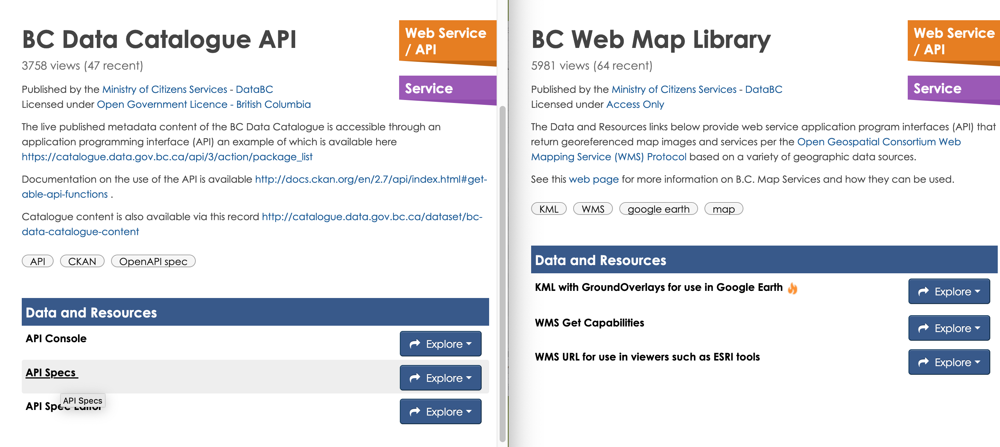

layout: true

---

```{r, include=FALSE}
# Copyright 2019 Province of British Columbia
# 
# Licensed under the Apache License, Version 2.0 (the "License");
# you may not use this file except in compliance with the License.
# You may obtain a copy of the License at
# 
# http://www.apache.org/licenses/LICENSE-2.0
# 
# Unless required by applicable law or agreed to in writing, software distributed under the License is distributed on an "AS IS" BASIS,
# WITHOUT WARRANTIES OR CONDITIONS OF ANY KIND, either express or implied.
# See the License for the specific language governing permissions and limitations under the License.
```


```{r setup, include=FALSE}
options(htmltools.dir.version = FALSE)
options(width = 90)
options(max_print = 5)
options(silence_named_get_record_warning = TRUE)

old.hooks <- fansi::set_knit_hooks(knitr::knit_hooks)
options(crayon.enabled = TRUE)

knitr::opts_chunk$set(
  collapse = TRUE,
  #echo = FALSE,
  comment = "",
  warning = FALSE,
  message = FALSE,
  fig.path = "graphics/prod/figs",
  fig.width = 10,
  fig.height = 5
)


options(scipen = 10)

library(dplyr)
library(bcdata)
library(sf)
library(mapview)
library(lwgeom)
library(rmapshaper)
library(ggplot2)
library(forcats)
```


class: middle, inverse, no-number

.left-title[

]

.large.right-title[
<br><br><br>
Sam Albers

Stephanie Hazlitt

Andy Teucher

------

Exchange Lab Lunch and Learn

2019-03-18
]


---
class: inverse

background-image: url(http://vietkings.org/userfiles/Parthenon.jpg)

# Pillars of Data Science

--

## Data Acquisition

--
## Data Processing

--
## Machine Learning & Statistics

--
## Analytics

--
## Communication


---
background-image: url(img/full-cycle.png)

# A workflow

---
class: middle, inverse

background-image: url(https://images.unsplash.com/photo-1497002961800-ea7dbfe18696?ixlib=rb-1.2.1&ixid=eyJhcHBfaWQiOjEyMDd9&auto=format&fit=crop&w=1352&q=80)

# What happens when you are asked to reproduce an analysis?

# Can you replicate the analysis with different data?

# What happens when a data-driven decision is audited?

---
background-image: url(img/data-science-workflow.png)

## Auditable, Replicable and Reproducible


.footnote[https://rstudio-education.github.io/tidyverse-cookbook/]

---
class: middle

## `write your analysis in code`

.Large.pull-left[

- Most common languages are python, R, C++, Java
- Open source programming languages
- Data analysis focus
- Cross-platform
  
  ]

.pull-right[
  
  ]
  

???

# What is R?

- R is an open-source programming language for data analysis and visualization.
- In many ways it is similar to other general purpose languages like Python
- originally created as a statistical programming language
- designed from the ground up around the manipulation, analysis, and visualization of data
- easy to make publication-quality graphics.
- available for Windows, MacOS and most popular Linux distributions.
- You can run it interactively by typing directly into the console, or from a sequence of commands written in scripts. 
- Scripts can be run against a dataset to produce a defined output, such as a chart or another dataset which contains the results of the analysis.
---

## poll: what programming languages do people use? what have they heard of?
---
background-image: url(img/data-science-workflow-not.png)

## Not Auditable, Replicable and Reproducible


.footnote[https://rstudio-education.github.io/tidyverse-cookbook/]


???

# Why R?

The entire workflow can be done efficiently in **R**, including:

- reading in raw data from many different sources - spatial and non-spatial, 
- preparing the data for analysis, including easily integrating tabular and spatial data,
- performing spatial data manipulation and analysis,
- performing statistical analysis
- creating publication-quality graphs and figures.
- All your iteration happens in one place, and is recorded in scripts
- **enables reproducible, repeatable, shareable analysis**

v


---
class: middle, inverse

background-image: url(https://i.imgur.com/modde9i.gif)

## `make your data available in code`

---
class: inverse

background-image: url(https://upload.wikimedia.org/wikipedia/commons/d/d5/British_Columbia_Parliament_Building%2C_Victoria%2C_British_Columbia%2C_Canada.jpg)

# Pillars of Data Science in BC Government


## <span style="color:#e3a82b">Data Acquisition</span>
## Data Processing
## Machine Learning & Statistics
## Analytics
## Communication

---

## poll: when was the last time you used the bcdata catalogue?

---
background-image: url(img/data-catalogue.png)
background-size: cover

---

background-image: url(img/dds.png)


???

BCGW Data Distribution Service

Way better than it was before

- Still a manual process
- GUI
- Can't be scripted, not repeatable

---
class: middle, inverse
# What's the problem here?

## `Can't get the data through code` 

---

# Application Programming Interfaces (APIs)
  


???
  
  APIs

Data BC provides important APIs:
  - the catalogue
- search and query data in the catalogue
- Web mapping service
- download spatial data 
- image overlay (WMS) OR the features themselves as points, lines, polygons (WFS)
- most warehouse objects with public record in the catalogue

---
class: middle

.Large.pull-left[

  # Let's make a package

  one `function()`
  
  two `function()`
  
  I need a `function()`
  ]

.pull-right[
  
  ]

???
  
  - As with most FOSS projects, initially made to solve personal problem, 
and several people had the same problem
- Solve (shared) friction point of manual searching and downloading data from BCDC
and getting it into R
- conversation

---
class: inverse, middle

.large.pull-left[
  <br/>
- .large[**`bcdc_browse()`**]
 - Open the catalogue in your default browser
- .large[**`bcdc_search()`**]
 - Search records in the catalogue
- .large[**`bcdc_get_record()`**]
  - Print a catalogue record
- .large[**`bcdc_preview()`**]
  - View B.C. geospatial data from a web mapping service
- .large[**`bcdc_get_data()`**]
  - Get catalogue data
- .large[**`bcdc_query_geodata()`**]
  - Get & query B.C. geospatial data from a web service
  ]

.pull-right[
  
    ]

???
  
- Collaboration
- first R package (personally) - sat in a room with a whiteboard and mapped out desired functionality and syntax
- Great approach
- Think landed in a good place
- **Today focus on _getting_ data**

---
  
## bcdc_get_data() - tabular

```{r echo=FALSE}
library(extrafont)
#font_import() ## takes a while to run
loadfonts(device = "win")

theme_set(
  theme_minimal() %+replace%
    theme(
      plot.title = element_blank(),
      axis.text = element_text(size = 18),
      axis.title = element_text(size = 18),
      text=element_text(family="Lucida Console")
    )
)
```

  
```{r, cache=TRUE}
(big_projects <- bcdc_get_data(record = "major-projects-inventory-economic-points", 
                              resource = '2b69cc4b-4076-4272-a5a0-1c731455e063'))
```

---
## Major Projects in British Columbia
```{r echo=FALSE, fig.width=15, fig.height=7}
big_projects %>% 
  group_by(CONSTRUCTION_TYPE) %>% 
  tally(ESTIMATED_COST) %>% 
  ggplot(aes(x = fct_reorder(CONSTRUCTION_TYPE, n), y = n)) +
  labs(title = "Major Projects in British Columbia", y = "", x = "") +
  geom_col() +
  coord_flip() +
  #scale_x_continuous(labels = scales::dollar)
  scale_y_continuous(labels = scales::dollar)
```

---
class: inverse
```{r, echo=FALSE}
## ## background-image: url(https://www.herocollector.com/Content/ArticleImages/7a716739-72cb-40d5-acfc-dfc35783d8a5.jpg)
```

## How do we reduce the cognitive load for interactive programming?


.pull-left[

<center></center>

]

.large.pull-right[
> a consistent set of verbs that help you solve the most common data manipulation challenges


]

---


## dplyr verbs

Functions with English meanings that map directly to the action being taken when that function is called

Installation: `install.packages("dplyr")`


.pull-left[
- `%>%` a special symbol to chain operations. Read it as "then"
- `select()` picks variables based on their names.
- `filter()` picks cases based on their values.
- `summarise()` reduces multiple values down to a single summary.
- `arrange()` changes the ordering of the rows.
- `mutate()` adds new variables that are functions of existing variables

For a offline tutorial: http://swcarpentry.github.io/r-novice-gapminder/13-dplyr/index.html
]


.pull-right[
<center></center>

Artwork by [@allison_horst](https://twitter.com/allison_horst)
] 

---
class: inverse, left, middle

# dplyr code break

---
  
## bcdc_query_geodata()  - spatial data
  
```{r, cache=TRUE}
bcdc_query_geodata("municipalities-legally-defined-administrative-areas-of-bc")
```

---
class: inverse, left, middle
# bcdata code break

---

### Select columns (attributes) with select()

```{r, cache=TRUE}
bcdc_query_geodata("municipalities-legally-defined-administrative-areas-of-bc") %>% 
  select(ADMIN_AREA_ABBREVIATION, ADMIN_AREA_GROUP_NAME) #<<
```

???
  
Familiar syntax
Processing on server

---
  
### Filter rows (features) with filter()
  
```{r, cache=TRUE}
bcdc_query_geodata("municipalities-legally-defined-administrative-areas-of-bc") %>% 
  select(ADMIN_AREA_ABBREVIATION, ADMIN_AREA_GROUP_NAME) %>% 
  filter(ADMIN_AREA_GROUP_NAME == "Capital Regional District") #<<
```

---
  
### Get the data with collect()
```{r, echo=FALSE}
mapviewOptions(legend.pos = 'topright')
```

```{r, cache=TRUE}
crd_mun <- bcdc_query_geodata("municipalities-legally-defined-administrative-areas-of-bc") %>% 
  select(ADMIN_AREA_ABBREVIATION, ADMIN_AREA_GROUP_NAME) %>% 
  filter(ADMIN_AREA_GROUP_NAME == "Capital Regional District") %>% 
  collect() #<<
```


```{r echo=FALSE}
library(rmapshaper)
crd_mun <- ms_simplify(crd_mun) %>% st_make_valid()
```

```{r}
mapview(crd_mun, zcol = "ADMIN_AREA_ABBREVIATION", layer = "Municipality")
```

---
  
### Let's find the 'greenest' city in the CRD
  
In addition to normal logical predicates (`==`. `!=`, `>`, `<`, etc.),
`filter()` can take *geometric predicates*:
  
`EQUALS`, `DISJOINT`, `INTERSECTS`, `TOUCHES`, `CROSSES`, `WITHIN`, `CONTAINS`, 
`OVERLAPS`, `DWITHIN`

```{r, cache=TRUE}
crd_greenspaces <- bcdc_query_geodata("local-and-regional-greenspaces") %>% 
  select(PARK_NAME, PARK_TYPE, PARK_PRIMARY_USE) %>% 
  filter(INTERSECTS(crd_mun)) %>% #<<
  collect()
```

```{r echo=FALSE}
crd_greenspaces <- ms_simplify(crd_greenspaces) %>% st_make_valid() %>% 
  st_collection_extract("POLYGON")
```

.footnote[https://catalogue.data.gov.bc.ca/dataset/local-and-regional-greenspaces]

---
```{r echo=FALSE}
mapviewOptions(leafletWidth = 1000, leafletHeight = 500)
```

  
```{r}
muni_map <- mapview(crd_mun, zcol = "ADMIN_AREA_ABBREVIATION", 
                    layer = "Municipality")

muni_map + 
  mapview(crd_greenspaces, col.regions = "darkolivegreen")
```

---
## Find the amount of green space in each municipality
  
```{r warning=FALSE}
library(sf)
grn_intersected <- st_intersection(crd_greenspaces, crd_mun)

grn_intersected_summary <- group_by(grn_intersected, ADMIN_AREA_ABBREVIATION) %>% 
  summarise(grn_area = sum(st_area(geometry)))

crd_mun <- left_join(crd_mun, st_drop_geometry(grn_intersected_summary), by = "ADMIN_AREA_ABBREVIATION") %>% 
  mutate(muni_area = st_area(geometry),
         percent_green = (grn_area / muni_area) * 100)
```

---
  
```{r}
mapview(crd_mun, zcol = "percent_green", layer = "Percent Green")
```

---
## Usage of bcdata

### bcgov
- https://github.com/bcgov/river-profiles
- https://github.com/bcgov/gwater-report
- https://github.com/bcgov/FAIB

### private sector
- https://github.com/poissonconsulting/fwabc

### academia
- https://github.com/starzomskilab/parks-gbif-tool


---
class: middle, inverse

background-image: url(https://upload.wikimedia.org/wikipedia/commons/thumb/6/6e/Monasterio_Khor_Virap%2C_Armenia%2C_2016-10-01%2C_DD_25.jpg/1280px-Monasterio_Khor_Virap%2C_Armenia%2C_2016-10-01%2C_DD_25.jpg)

# Reproducible ✔️ 

# Repeatable ✔️ 

# Auditable ✔️ 

---

## Kudos

.large.wide-right[
- BC Data Catalogue Team

- Michelle Douville

- Simon Norris

- Our bosses for giving us time/space for innovation and collaboration
  ]
  

.wide-left[
  
    ]

---
# Questions
  
.large.right-column[
  <br/>
- Install from CRAN:
- https://cran.r-project.org/package=bcdata
 - `install.packages("bcdata")`
- Help & documentation:
 - https://bcgov.github.io/bcdata
- Issues/bugs:
 - https://github.com/bcgov/bcdata/issues
  ]

.left-column[
  
    ]