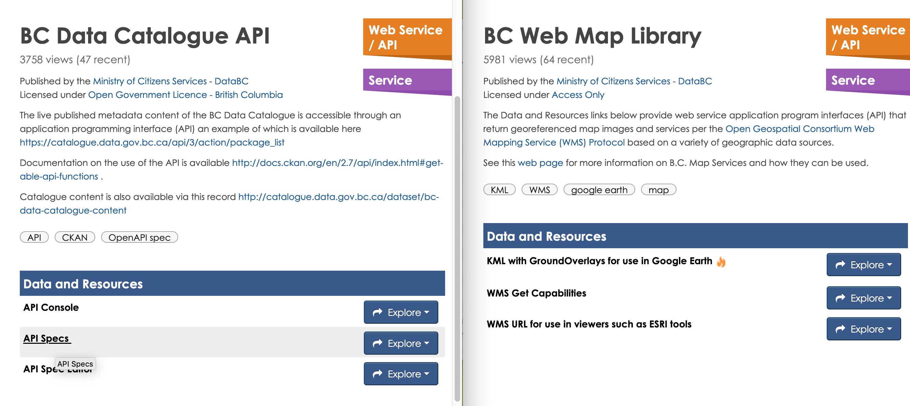

layout: true

---

```{r, include=FALSE}
# Copyright 2019 Province of British Columbia
# 
# Licensed under the Apache License, Version 2.0 (the "License");
# you may not use this file except in compliance with the License.
# You may obtain a copy of the License at
# 
# http://www.apache.org/licenses/LICENSE-2.0
# 
# Unless required by applicable law or agreed to in writing, software distributed under the License is distributed on an "AS IS" BASIS,
# WITHOUT WARRANTIES OR CONDITIONS OF ANY KIND, either express or implied.
# See the License for the specific language governing permissions and limitations under the License.
```


```{r setup, include=FALSE}
options(htmltools.dir.version = FALSE)
options(width = 90)
options(max_print = 5)
options(silence_named_get_record_warning = TRUE)

knitr::opts_chunk$set(
  collapse = TRUE,
  #echo = FALSE,
  comment = "#>",
  warning = FALSE,
  message = FALSE,
  fig.path = "graphics/prod/figs",
  fig.width = 8,
  fig.height = 5
)

options(scipen = 10)

library(dplyr)
library(bcdata)
library(sf)
library(mapview)
library(lwgeom)
library(rmapshaper)
```


class: middle, inverse, no-number

.left-title[

]

.large.right-title[
<br><br><br>
Andy Teucher<small><sup>1</sup></small>

Sam Albers<small><sup>2</sup></small> 

Stephanie Hazlitt<small><sup>2</sup></small>

------

GIS CoP Face to Face

2019-11-27
]

.footnote-right[
<br><br>
1: Ministry of Environment & Climate Change Strategy

2: Ministry of Citizens' Services
]

---

background-image: url(img/full-cycle.png)

---

background-image: url(img/Rlogo.png)

## Open source programming language
## Data analysis focus
## Cross-platform

???

# What is R?

- R is an open-source programming language for data analysis and visualization.
- In many ways it is similar to other general purpose interpreted languages like Python, but unlike Python, R was originally created as a statistical programming language and so it is designed from the ground up around the manipulation, analysis, and visualization of data - it is now often considered the 'lingua franca' of data.
- It also easy to make publication-quality graphics.
- R is available for Windows, MacOS and most popular Linux distributions.
- You can run it interactively by typing directly into the console, or from a sequence of commands written in text files, or "scripts". Scripts can be run against a dataset to produce a defined output, such as a chart or another dataset which contains the results of the analysis.

---

background-image: url(img/R-flow.png)

???

# Why R?

The entire workflow can be done efficiently in **R**, including:

- reading in raw data from many different sources - spatial and non-spatial, 
- preparing the data for analysis, including easily integrating tabular and spatial data,
- performing spatial data manipulation and analysis,
- performing statistical analysis
- creating publication-quality graphs and figures.
- All your iteration happens in one place, and is recorded in scripts
- **enables reproducible, repeatable, shareable analysis**

---
exclude: true

background-image: url(img/bcdc.png)
background-size: cover

--- 

background-image: url(img/dds.png)
background-size: cover

???

BCGW Data Distribution Service

Way better than it was before

- Still a manual process
- Can't be scripted, not repeatable

---

# Application Programming Interfaces (APIs)



???

APIs

Data BC provides important APIs:
- the catalogue
  - search and query data in the catalogue
- Web mapping service
  - download spatial data 
    - image overlay (WMS) OR the features themselves as points, lines, polygons (WFS)

---

class: middle

.Large.pull-left[
one `function()`

two `function()`

I need a `function()`
]

.pull-right[
 
]

???

- As with most FOSS projects, initially made to solve personal problem, 
and several people had the same problem
- Solve (shared) friction point of manual searching and downloading data from BCDC
and getting it into R

---

class: inverse, middle

.large.pull-left[
<br/>
- **`bcdc_browse()`** 
  - Open the catalogue in your default browser
- **`bcdc_search()`** 
  - Search records in the catalogue
- **`bcdc_get_record()`** 
  - Print a catalogue record
- **`bcdc_get_data()`** 
  - Get catalogue data
- **`bcdc_query_geodata()`** 
  - Get & query B.C. geospatial data from a web service
]

.pull-right[


]

---
exclude: true

## `bcdc_search()`

Search the B.C. Data Catalogue

```{r}
library(bcdata)
bcdc_search("school programs")
```

---
exclude: true

## `bcdc_get_record()`

Get the metadata for a record in the B.C. Data Catalogue


---
exclude: true

```{r}
library(bcdata)
bcdc_get_record("bc-schools-programs-offered-in-schools")
```

---
exclude: true

## `bcdc_get_data()` - tabular data

```r
bcdc_get_data(record = 'b1f27d1c-244a-410e-a361-931fac62a524', 
              resource = 'a393f8cf-51ec-42c6-8449-4cea4c75385c')
```

```{r echo=FALSE}
set.seed(1)
bcdc_get_data(record = 'b1f27d1c-244a-410e-a361-931fac62a524', resource = 'a393f8cf-51ec-42c6-8449-4cea4c75385c') %>% 
  mutate_if(is.logical, function(x) {
    x[is.na(x)] <- FALSE
    x}) %>% 
  sample_n(6) %>% 
  select(c("District Name", "School Name", 
           "Has Core French", "Has Apprenticeship Prog")) %>% 
  knitr::kable(format = "html")
```

---

## `bcdc_get_data()` - spatial data

```{r eval=FALSE}
bcdc_get_data("bc-airports", resource = "4d0377d9-e8a1-429b-824f-0ce8f363512c")
```
```{r}
### OR use BCGW name #####
airports <- bcdc_get_data("WHSE_IMAGERY_AND_BASE_MAPS.GSR_AIRPORTS_SVW")

library(mapview)
mapview(airports)
```

---

## `bcdc_query_geodata()`

```{r}
bcdc_query_geodata("municipalities-legally-defined-administrative-areas-of-bc")
```

---

### Select columns (attributes) with `select()`

```{r}
bcdc_query_geodata("municipalities-legally-defined-administrative-areas-of-bc") %>% 
  select(ADMIN_AREA_ABBREVIATION, ADMIN_AREA_GROUP_NAME)
```

---

### Filter rows (features) with `filter()`

```{r}
bcdc_query_geodata("municipalities-legally-defined-administrative-areas-of-bc") %>% 
  select(ADMIN_AREA_ABBREVIATION, ADMIN_AREA_GROUP_NAME) %>% 
  filter(ADMIN_AREA_GROUP_NAME == "Capital Regional District")
```

---

### Get the data with `collect()`
```{r, echo=FALSE}
mapviewOptions(legend.pos = 'topleft')
```


```{r}
crd_mun <- bcdc_query_geodata("municipalities-legally-defined-administrative-areas-of-bc") %>% 
  select(ADMIN_AREA_ABBREVIATION, ADMIN_AREA_GROUP_NAME) %>% 
  filter(ADMIN_AREA_GROUP_NAME == "Capital Regional District") %>% 
  collect()
```


```{r echo=FALSE}
library(rmapshaper)
crd_mun <- ms_simplify(crd_mun) %>% st_make_valid()
```

```{r fig.width=10}
mapview(crd_mun, zcol = "ADMIN_AREA_ABBREVIATION", layer = "ADMIN_AREA")
```

---

### Let's find the 'greenest' city in the CRD

In addition to normal logical predicates (`==`. `!=`, `>`, `<`, etc.),
`filter()` can take *geometric predicates*:

`EQUALS`, `DISJOINT`, `INTERSECTS`, `TOUCHES`, `CROSSES`, `WITHIN`, `CONTAINS`, 
`OVERLAPS`, `RELATE`, `DWITHIN`, `BEYOND`

```{r}
crd_greenspaces <- bcdc_query_geodata("local-and-regional-greenspaces") %>% 
  select(PARK_NAME, PARK_TYPE, PARK_PRIMARY_USE) %>% 
  filter(INTERSECTS(crd_mun)) %>% 
  collect()
```

```{r echo=FALSE}
crd_greenspaces <- ms_simplify(crd_greenspaces) %>% st_make_valid() %>% 
  st_collection_extract("POLYGON")
```

---

```{r, fig.width=10}
muni_map <- mapview(crd_mun, zcol = "ADMIN_AREA_ABBREVIATION", layer = "ADMIN_AREA")
muni_map + 
  mapview(crd_greenspaces, col.regions = "darkolivegreen")
```

---

```{r warning=FALSE}
library(sf)
grn_intersected <- st_intersection(crd_greenspaces, crd_mun)

grn_intersected_summary <- group_by(grn_intersected, 
                                    ADMIN_AREA_ABBREVIATION) %>% 
  summarise(grn_area = sum(st_area(geometry)))

crd_mun <- left_join(crd_mun, st_drop_geometry(grn_intersected_summary), 
                     by = "ADMIN_AREA_ABBREVIATION") %>% 
  mutate(muni_area = st_area(geometry),
         percent_green = (grn_area / muni_area) * 100)
```

---

```{r}
mapview(crd_mun, zcol = "percent_green", layer = "percent-green")
```

---

.large.left-column[
BC Data Catalogue Team

Michelle Douville

Simon Norris

Our bosses for giving us time/space for innovation and collaboration
]

.right-column[

]

---

class: middle

.large.pull-left[
<br/>
- Install from CRAN:
  - cran.r-project.org/package=bcdata
  - `install.packages("bcdata")`
- Help & documentation:
  - bcgov.github.io/bcdata
- Issues/bugs:
  - github.com/bcgov/bcdata/issues
]

.pull-right[


.footnote[https://bcgov.github.io/bcdata]
]