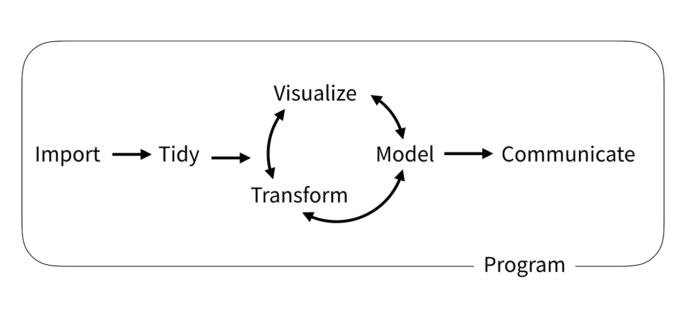
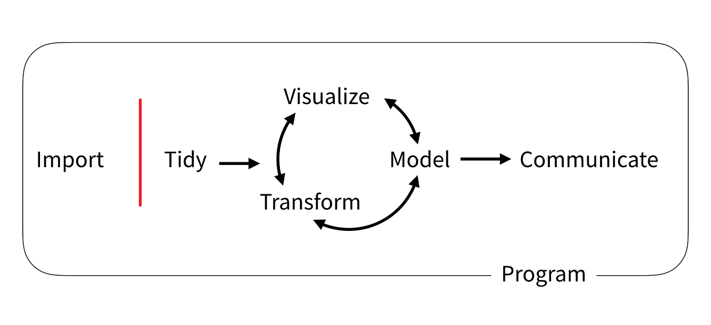
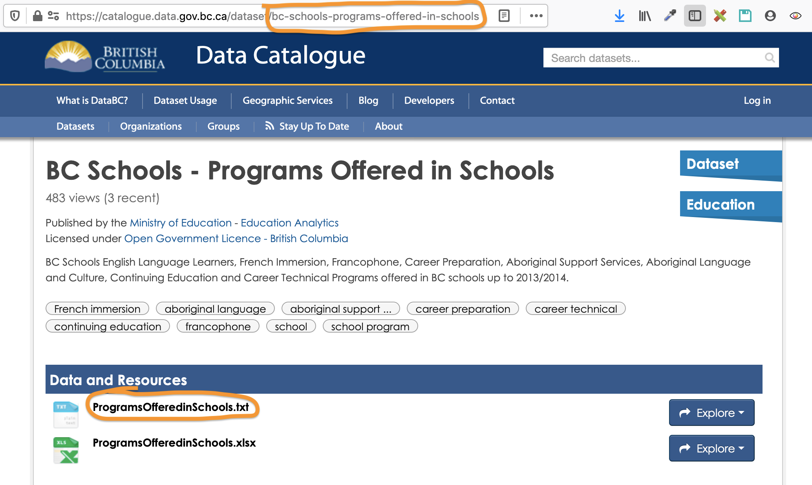

layout: true

---

```{r include=FALSE, eval=FALSE}
# Copyright 2019 Province of British Columbia
# 
# Licensed under the Apache License, Version 2.0 (the "License");
# you may not use this file except in compliance with the License.
# You may obtain a copy of the License at
# 
# http://www.apache.org/licenses/LICENSE-2.0
# 
# Unless required by applicable law or agreed to in writing, software distributed under the License is distributed on an "AS IS" BASIS,
# WITHOUT WARRANTIES OR CONDITIONS OF ANY KIND, either express or implied.
# See the License for the specific language governing permissions and limitations under the License.
# 
# Abstract
# 
# The British Columbia government hosts over 2000 tabular and spatial data sets
# in the B.C. Data Catalogue.  Most provincial spatial data is available through
# the B.C. Data Catalogue under an open licence, via a Geoserver Web Feature
# Service (WFS). WFS is a powerful and flexible service for distributing
# geographic features over the web, that supports both spatial and non-spatial
# querying.  Our package, bcdata, wraps this functionality and enables R users
# to efficiently query and directly read spatial data from the B.C. Data
# Catalogue into their R session. The bcdata package implements a novel
# application of dbplyr using a web service backend, where a locally constructed
# query is processed by a remote server. The data is only downloaded, and loaded
# into R as an ‘sf’ object, once the query is complete and the user requests the
# final result. This allows for fast and efficient spatial data retrieval using
# familiar dplyr syntax. The package also provides functionality that enables
# users to search and retrieve many other types of data and metadata from the
# B.C. Data Catalogue, thereby connecting British Columbia open data holdings
# with the vast capabilities of R.

```

```{r setup, include=FALSE}
options(htmltools.dir.version = FALSE)
options(width = 90)
options(max_print = 5)
options(silence_named_get_record_warning = TRUE)

old.hooks <- fansi::set_knit_hooks(knitr::knit_hooks)
options(crayon.enabled = TRUE)

knitr::opts_chunk$set(
  collapse = TRUE,
  #echo = FALSE,
  comment = "",
  warning = FALSE,
  message = FALSE,
  fig.path = "graphics/prod/figs",
  fig.width = 10,
  fig.height = 5
)

options(scipen = 10)

library(dplyr)
library(bcdata)
library(sf)
library(mapview)
library(rmapshaper)
library(ggplot2)
library(rnaturalearth)

bc <- bcdata::bcdc_query_geodata("b9bd93e1-0226-4351-b943-05c6f80bd5da") %>% 
  filter(REGION_CODE == "59") %>% 
  collect()

gg_bc <- function() {
  ggplot() + 
  geom_sf(data = bc, fill = "#eeeeee")
}

theme_set(theme_void() +
  theme(panel.background = element_rect(fill = "transparent", color = NA),
        plot.background = element_rect(fill = "transparent", color = NA), 
        plot.margin = unit(c(0,0,0,0), units = "cm"),
        panel.spacing = unit(0, units = "cm")))

hack_print <- function(...) {
  out <- capture.output(...)
  out <- gsub("administrative-areas-of-bc", "admin...", out)
  out <- gsub("on this object ", "", out)
  cat(out[!grepl("dimension:|bbox", out)], sep = "\n")
}
```


class: middle, inverse, no-number

.left-title[.no-margin[

]
]

.large.right-title[

Andy Teucher<small><sup>1</sup></small>

Sam Albers<small><sup>2</sup></small> 

Stephanie Hazlitt<small><sup>2</sup></small>

------

UseR! 2020

.pull-left[

]

.pull-right[

]
]

.affiliations[
1: Ministry of Environment & Climate Change Strategy&nbsp;&nbsp;&nbsp;
2: Ministry of Citizens' Services
]

???

- tell you about our newest package bcdata
- for retrieving public data from British Columbia data repositories, 
especially spatial data

---

background-image: url(https://upload.wikimedia.org/wikipedia/commons/d/d5/British_Columbia_Parliament_Building%2C_Victoria%2C_British_Columbia%2C_Canada.jpg)
background-size: cover

.pull-left[
```{r echo=FALSE, fig.height=9, fig.width=8, dev.args=list(bg="transparent"), cache=TRUE}
na <- ne_countries(country = c("Canada","United States of America", "Mexico"), returnclass = "sf") %>% 
  st_transform('PROJCS["North_America_Albers_Equal_Area_Conic",GEOGCS["GCS_North_American_1983",DATUM["North_American_Datum_1983",SPHEROID["GRS_1980",6378137,298.257222101]],PRIMEM["Greenwich",0],UNIT["Degree",0.017453292519943295]],PROJECTION["Albers_Conic_Equal_Area"],PARAMETER["False_Easting",0],PARAMETER["False_Northing",0],PARAMETER["longitude_of_center",-96],PARAMETER["Standard_Parallel_1",20],PARAMETER["Standard_Parallel_2",60],PARAMETER["latitude_of_center",40],UNIT["Meter",1],AUTHORITY["EPSG","102008"]]')

cities <- st_sf(
  name = c("St. Louis", "Victoria"),
  st_sfc(st_point(c(-90.1994, 38.6570)), 
         st_point(c(-123.3565, 48.4284)), 
         crs = 4326)
)

ggplot() + 
  geom_sf(data = na) +
  geom_sf(data = ms_simplify(bc, keep = 0.1), fill = "#a0d080") +
  geom_sf(data = cities, size = 4) + 
  geom_sf_text(aes(label = name), data = cities, 
               nudge_x = -900000, nudge_y = -100000, 
               size = 12, colour = c("black", "white")) +
  coord_sf(xlim = c(-4000000, 2989998), expand = FALSE)
```
]

???

- British Columbia is really big (almost 1M sq km)
- Lots of data
- I work in Ministry of Environment and Climate Change Strategy
- Group I work in analyses & reports on status and trends of BC's environment
- Big proponents of open data and open science

---

# Reproducible data science



.footnote[https://rstudio-education.github.io/tidyverse-cookbook/]

???

- "Program" is the important part
Writing all of the steps in code makes it reproducible

---

# !(Reproducible data science)



.footnote[https://rstudio-education.github.io/tidyverse-cookbook/]


???

- All too often data is not easily available for programmatic import

If the data acquisition step is manual then collaborators, reviewers, etc can't import, 
and the entire workflow is not reproducible

If we can add the data acquisition step in code the whole cycle is reproducible

---

class: inverse, middle
background-image: url(https://images.unsplash.com/photo-1511721285502-9f81e79be874?ixlib=rb-1.2.1&ixid=eyJhcHBfaWQiOjEyMDd9&auto=format&fit=crop&w=1868&q=80)
background-size: cover

# The B.C. Data catalogue

???

- introduce

---

background-image: url(img/data-catalogue.png)
background-size: cover


???

- Thousands of data sets, mostly under an open license
- tabular and spatial

---

background-image: url(img/dds.png)
background-size: cover


???

If you want to work with data you can point and click and 
download all sorts

Very handy, can download large spatial data files
Can specify projections and Area of Interest


---
class: inverse
# What's the problem here?

--

## Not getting the data through code breaks the reproducibility

???

- Still a manual process
- GUI
- Can't be scripted, not repeatable

---

# Application Programming Interfaces (APIs)
  


???

Luckly also APIs

Data BC provides two important APIs:
- the catalogue
  - search and query data in the catalogue
- Web mapping service
  - download spatial data 
    - image overlay (WMS) AND
    - most importantly the features themselves as points, lines, polygons (WFS)
      - powerful and flexible service for distributing geographic features over the web
      supports both spatial and non-spatial querying via REST API

---

class: middle

.Large.pull-left[

  # Let's make a package

  one function()
  
  two function()
  
  I need a function()
  ]

.pull-right[
  
  ]

???
  
- As with many FOSS projects, initially made to solve personal problem, 
and several people had the same problem
- Solve (shared) friction point of manual searching and downloading data from BCDC
and getting it into R
- Collaboration

---
class: inverse, middle

.large.wide-left[
- **`bcdc_search()`** 
  - Search catalogue records
- **`bcdc_get_record()`** 
  - Print a catalogue record
- .Large[**`bcdc_get_data()`**]
  - Get catalogue data
- .Large[**`bcdc_query_geodata()`**]
  - Query B.C. geospatial data
]

.wide-right[


]

???

- Today focus on _getting_ data

---
exclude: true

# `bcdc_search()`

```{r}
library(bcdata)
bcdc_search("school programs")
```

---

.no-margin[

]

???

---
exclude: true

# `bcdc_get_record()`

```{r}
bcdc_get_record("bc-schools-programs-offered-in-schools")
```

???

---
exclude: false

# `bcdc_get_data()` - tabular data

```r
bcdc_get_data(
  record = 'b1f27d1c-244a-410e-a361-931fac62a524', 
  resource = 'a393f8cf-51ec-42c6-8449-4cea4c75385c'
)
```

```{r echo=FALSE}
set.seed(1)
bcdc_get_data(record = 'b1f27d1c-244a-410e-a361-931fac62a524', 
              resource = 'a393f8cf-51ec-42c6-8449-4cea4c75385c') %>% 
  mutate_if(is.logical, function(x) {
    x[is.na(x)] <- FALSE
    x}) %>% 
  sample_n(6) %>% 
  select(c("District Name", "School Name", 
           "Has Core French", "Has Apprenticeship Prog")) %>% 
  knitr::kable(format = "html")
```

???

---

exclude: true

# `bcdc_get_data()` - spatial data

```{r}
ferries <- bcdc_get_data("ferry-terminals", 
  "40d2b150-06a8-488c-8d88-d9df978d696d")
```

.pull-left[
```{r eval=FALSE}
gg_bc() + 
geom_sf(data = ferries, 
        colour = "darkred")
```
]

.pull-right.no-margin[
```{r echo=FALSE, fig.height=7}
gg_bc() + 
  geom_sf(data = ferries, 
          colour = "darkred")
```
]

???

---

# Query spatial data with `bcdc_query_geodata()`

```{r, eval=FALSE}
bcdc_query_geodata(
"municipalities-legally-defined-administrative-areas-of-bc"
)
```

???

- WFS: 
  - standard for accessing geospatial data over the web
  - offers direct fine-grained access to geographic information at the feature and feature property level
  - https://www.ogc.org/standards/wfs
  - Implemented by Geoserver (http://geoserver.org/)
  - very flexible interface allowing non-spatial and spatial querying
  - means processing is done on the server and you can query and download just 
  what you need

Object returned here is not the data itself, but a "promise"
to get the data, need to run collect() - like dbplyr.

---

```{r, cache=FALSE, echo=FALSE}
hack_print({
bcdc_query_geodata(
"municipalities-legally-defined-administrative-areas-of-bc"
)
})
```

???

printing the object shows a brief preview (6 rows) with
some additional information

---

# Select columns with `select()`

```{r, eval=FALSE}
bcdc_query_geodata(
"municipalities-legally-defined-administrative-areas-of-bc"
) %>% 
  select(ADMIN_AREA_ABBREVIATION, #<<
         ADMIN_AREA_GROUP_NAME) #<<
```

.large[**tidyselect** helpers work:

.center[`starts_with()`, `matches()`, `one_of()` etc.]
]

???
  
Familiar syntax
Processing on server

---

```{r, cache=FALSE, echo=FALSE}
hack_print({
bcdc_query_geodata(
"municipalities-legally-defined-administrative-areas-of-bc"
) %>% 
  select(ADMIN_AREA_ABBREVIATION,
         ADMIN_AREA_GROUP_NAME)
})
```

???

Some sticky columns always come along for the ride

---

# Filter rows (features) with `filter()`
  
```{r, eval=FALSE}
bcdc_query_geodata(
"municipalities-legally-defined-administrative-areas-of-bc"
) %>% 
  select(ADMIN_AREA_ABBREVIATION, 
         ADMIN_AREA_GROUP_NAME) %>% 
  filter( #<<
    ADMIN_AREA_GROUP_NAME == "Capital Regional District" #<<
  ) #<<
```

.large[.center[`==`, `!=`, `>`, `<`, `between()`, `%in%`, `is.na()`, etc.]]

???

---

```{r, cache=FALSE, echo=FALSE}
hack_print({
  bcdc_query_geodata(
"municipalities-legally-defined-administrative-areas-of-bc"
) %>% 
  select(ADMIN_AREA_ABBREVIATION, 
         ADMIN_AREA_GROUP_NAME) %>% 
  filter(
    ADMIN_AREA_GROUP_NAME == "Capital Regional District"
  )
})
```

???

---
  
# Finally, get the data with `collect()`


```{r, cache=TRUE}
crd_mun <- bcdc_query_geodata(
"municipalities-legally-defined-administrative-areas-of-bc"
) %>% 
  select(ADMIN_AREA_ABBREVIATION, 
         ADMIN_AREA_GROUP_NAME, 
         FEATURE_AREA_SQM) %>% 
  filter(
    ADMIN_AREA_GROUP_NAME == "Capital Regional District"
  ) %>% 
  collect() #<<
```

???

- Same as dbplyr

---
```{r echo = FALSE}
hack_print(crd_mun)
```


```{r echo=FALSE}
library(rmapshaper)
crd_mun <- ms_simplify(crd_mun) %>% st_make_valid()
```

???

- Now we have a real sf object we can work with that has
just the rows and columns we asked for

---

```{r fig.align="center", fig.height=6}
ggplot(crd_mun, aes(fill = ADMIN_AREA_ABBREVIATION)) + 
  geom_sf() +
  scale_fill_viridis_d()
```

???

---
  
# `filter()` with *geometric* predicates

In addition to normal logical predicates
  
.pull-left[
.right[
`EQUALS()`

`DISJOINT()`

`INTERSECTS()`

`TOUCHES()`

`CROSSES()`
]
]

.pull-right[
`WITHIN()`

`CONTAINS()`

`OVERLAPS()`

`DWITHIN()`

`BBOX()`
]

???

---
  
# Find the greenspaces within the CRD

```{r, cache=TRUE}
crd_greenspaces <- bcdc_query_geodata(
  "local-and-regional-greenspaces"
) %>% 
  select(PARK_NAME, PARK_TYPE, PARK_PRIMARY_USE) %>% 
  filter(INTERSECTS(crd_mun)) %>% #<<
  collect()
```

```{r echo=FALSE}
crd_greenspaces <- ms_simplify(crd_greenspaces) %>% st_make_valid() %>% 
  st_collection_extract("POLYGON")
```

.footnote[https://catalogue.data.gov.bc.ca/dataset/local-and-regional-greenspaces]

???

Rather than downloading all of the greenspaces in BC (A LOT)
and then filtering, we are getting the server to do the filtering
for us and just downloading what we need.

---

```{r fig.align="center", fig.height=6}
ggplot(crd_mun, aes(fill = ADMIN_AREA_ABBREVIATION)) + 
  geom_sf() + scale_fill_viridis_d() + 
  geom_sf(data = crd_greenspaces, fill = "darkolivegreen")
```

???

---

# bcdata

.large[
- Programmatic access to thousands of data sets from the B.C. Data Catalogue
- Novel interface to a WFS service
- Familiar dplyr/dbplyr syntax
- Perform spatial and non-spatial queries
- processing on the server - only download what you need
]

???

- next steps - standalone wfs package use with other WFS services

---

.pull-left[
  
]

.large.pull-right[
- Collaborators:
  - Sam Albers 
  - Stephanie Hazlitt
- BC Data Catalogue Team
- Our employers for encouraging innovation and collaboration
]

???
    
---

.left-column[


<br/>
[@andyteucher](https://twitter.com/andyteucher)
[@big_bad_sam](https://twitter.com/big_bad_sam)
[@stephhazlitt](https://twitter.com/stephhazlitt)
]

.right-column[
- Install from CRAN:
 - `install.packages("bcdata")`
- Documentation:
 - https://bcgov.github.io/bcdata
- Issues/bugs:
 - https://github.com/bcgov/bcdata/issues
- Slides:
 - https://bcgov.github.io/bcgov-rstats-public-presentations/2020-07-UseR2020-bcdata/2020-07-UseR2020-bcdata.html
]


???
